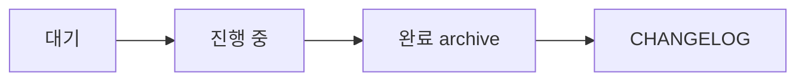

# Git 워크플로우 (Git Workflow)

이 문서는 `spring-backend-template` 의 Git 사용 규약을 정의합니다.

**관련 문서**:
- `docs/conventions/versioning.md` — 버전 규약 · 릴리스 프로세스 · Deprecation
- `docs/guides/cross-repo-cherry-pick.md` — 템플릿 ↔ 파생 레포 동기화

---

## 브랜치 구조 (템플릿 레포)

```
main                    항상 릴리스 가능 상태. 태그 부착 지점.
 ↑
feature/<topic>         모든 작업. PR 로만 main 통합.
release/v<x.y.z>        릴리스 PR 전용 브랜치.
```

파생 레포는 자기 사정에 맞게 GitFlow 등 채택 (템플릿이 강제하지 않음).

---

## Merge 전략: Rebase merge only

- 개별 커밋 보존 → cherry-pick 재료
- Linear history → `git log`/`git diff` 가독성
- Squash / Merge commit 비활성 (GitHub Settings)

**GitHub Repository Settings**:
- Settings → General → Pull Requests
  - ☑ Allow rebase merging
  - ☐ Allow squash merging
  - ☐ Allow merge commits
  - ☑ Automatically delete head branches
- Settings → Branches → main (Branch protection)
  - ☑ Require pull request before merging
  - ☑ Require status checks: `commit-lint`, `pr-title`, `changelog-check`, `test`, `archunit`
  - ☑ Require branches to be up to date
  - ☑ Require linear history

---

## Conventional Commits 규약

### 포맷

```
<type>(<scope>): <subject>

<body (optional)>

<footer (optional, BREAKING CHANGE / Refs)>
```

### Type (10 개)

| type | 의미 | 버전 영향 |
|---|---|---|
| `feat` | 새 기능 | minor |
| `fix` | 버그 수정 | patch |
| `docs` | 문서만 | patch |
| `style` | 포맷팅 | patch |
| `refactor` | 행위 변화 없는 재구성 | patch |
| `perf` | 성능 개선 | patch |
| `test` | 테스트 추가·수정 | patch |
| `chore` | 빌드·의존 업데이트 | patch |
| `build` | 빌드 시스템 | patch |
| `ci` | CI 설정 | patch |

### Scope (선택)

`auth`, `user`, `device`, `push`, `billing`, `common`, `bootstrap`, `spec`, `docs`, `core`, `apps`

Scope 없어도 허용 (warning). 집합 밖 scope 도 warning.

### Breaking Change

**방법 1** — subject 에 `!`:
```
feat(user)!: rename UserSummary.name to displayName
```

**방법 2** — footer 에 `BREAKING CHANGE:`:
```
feat(user): rename UserSummary.name to displayName

BREAKING CHANGE: UserSummary.name renamed to displayName.
Migration: search/replace `userSummary.name()` → `userSummary.displayName()`.
```

Breaking 감지 시 **major bump 필수**.

### 예시

**허용**:
```
feat(auth): add isPremium field to AuthResponse
fix(user): correct null handling in UserSummary
docs(spec): Item 3 버저닝 설계 추가
feat(user)!: rename UserSummary.name to displayName
```

**거부**:
```
auth 고침              → type 없음
Fix: bug               → type 대문자
feat: Added feature    → subject 명령형 아님
feat(auth):add field   → 콜론 뒤 공백 없음
```

---

## 강제 메커니즘 (3중 방어)

### 1차: 로컬 commit-msg hook

`.husky/commit-msg` + `commitlint.config.js` 가 커밋 순간 검증. 실패 시 커밋 자체 거부.

**설정 (최초 1회)**:
```bash
npm install              # husky 자동 활성화 (prepare script)
git config --local commit.template .gitmessage
```

### 2차: CI commitlint

`.github/workflows/commit-lint.yml` 이 PR 의 모든 커밋 메시지 검사. `--no-verify` 로 우회한 경우에도 잡음.

### 3차: PR 타이틀 검증

`.github/workflows/pr-title.yml` 이 PR 타이틀 포맷 검사.

### 보조 도구

- **`.gitmessage`** — `git commit` (메시지 없이) 실행 시 에디터에 템플릿 로드
- **Commitizen** — `npx cz` 로 대화형 커밋 생성
- **IDE 확장** — IntelliJ "Conventional Commit" / VS Code "Conventional Commits"

---

## 커밋 위생 (Cherry-pick 가능성)

**원칙**: 한 커밋은 한 논리적 변경만.

- 공통 코드 수정과 도메인 코드 수정을 같은 커밋에 섞지 않음 (philosophy.md)
- 파생 레포에서 우연히 공통 코드 고친 경우 **별도 커밋으로 분리**
- 템플릿 레포는 apps/ 가 비어있어 혼합 위험 없음

---

## 릴리스 프로세스 (요약)

자세한 절차는 `versioning.md`. 요약:

### 평상시

```bash
git checkout -b feat/topic
# ... 작업 + conventional commits ...
# CHANGELOG [Unreleased] 업데이트
git push
# PR → CI green → Rebase merge
```

### 릴리스

```bash
git checkout -b release/v0.3.0
# CHANGELOG [Unreleased] → [0.3.0] - YYYY-MM-DD 이동 + 새 빈 [Unreleased]
git commit -m "chore: release v0.3.0"
git push
# PR "chore: release v0.3.0" → CI green → Rebase merge

git checkout main && git pull
git tag -a template-v0.3.0 -m "Release v0.3.0"
git push origin template-v0.3.0
# GitHub Actions 자동으로 Release 생성
```

---

## Backlog 운영 규칙

`docs/backlog.md` 는 "지금 안 하지만 잊지 말 것" 을 추적합니다. 기술부채, 미완 기능, 운영 배포 대기 항목 등. 파생 레포가 생긴 후에도 **이 목록이 있어야 잊힘을 방지**할 수 있습니다.

### 항목 추가

기술부채나 미완 항목을 발견하는 즉시 `docs/backlog.md` 에 추가합니다.

형식:
```
- [ ] [카테고리] 제목 — 이유 (생성일: YYYY-MM-DD)
```

카테고리: `Ops` / `Data` / `Obs` / `Security` / `Feature` / `DX` / `Template`

### 항목 처리 흐름



- **대기 → 진행 중**: 항목을 "진행 중" 섹션으로 이동 + `(담당 Item: Item X)` 추가
- **진행 중 → 완료**: "완료 (archive)" 로 이동 + 커밋 해시 연결. 예:
  ```
  - [x] [Ops] ... — 이유 (완료일: YYYY-MM-DD, commit: abcdef0)
  ```
- **archive → CHANGELOG 이관**: 2개월마다 archive 섹션의 오래된 항목을 CHANGELOG 의 해당 버전 섹션으로 이동. backlog.md 는 가볍게 유지.

### 새 Item plan 작성 시 체크리스트

Item 시작 전에 **반드시** backlog 를 점검:

1. `backlog.md` 의 대기 목록을 훑어 **이 Item 과 관련된 항목** 을 식별
2. 관련 항목을 plan 의 scope 선언에 포함
3. Plan 작성 시 "이 항목들이 본 Item 에서 해소됨" 명시
4. Item 완료 시 backlog 항목들을 일괄 archive + 커밋 해시 연결

이 흐름이 없으면 backlog 가 stale 해지고 항목이 영영 잊힙니다.

---

## 문서 자동 검증 (docs-check)

`tools/docs-check/docs-contract-test.sh` 가 CI 에서 문서 drift 를 자동 검증:

| 체크 | 확인 사항 |
|---|---|
| C1 | Item 7 rename 된 심볼 (`UserCredentials`, `TokenPair`, `PushResult`, `verifyReceipt`, `toCredentials`) 이 문서에 잔존 X (CHANGELOG / plans 예외) |
| C2 | Markdown 상대 경로 링크 (`./` 또는 `../` 로 시작) 의 대상 파일 존재 |
| C3 | 문서에 언급된 env var (`APP_*` / `SPRING_*` / `JWT_*` 등) 가 `.env.example` 또는 `application-*.yml` 에 정의됨 |

### 로컬 실행
```bash
./tools/docs-check/docs-contract-test.sh
```

### False positive 처리
`tools/docs-check/exclusions.conf` 에 `<check-id>:<pattern>` 추가 (이유 주석 필수).

### 트리거
`.github/workflows/docs-check.yml` — PR + push-to-any-branch 에서 실행.

---

## 참조

- `docs/philosophy.md` 결정 2 (템플릿 전파 방식)
- `docs/conventions/versioning.md` (버전 규약 · Deprecation)
- `docs/guides/cross-repo-cherry-pick.md` (파생 레포 동기화)
- `docs/backlog.md` (실제 목록)
