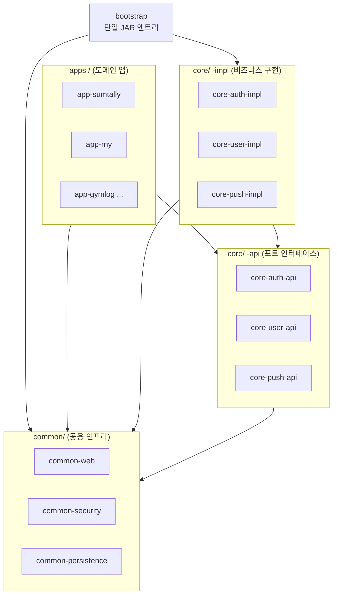
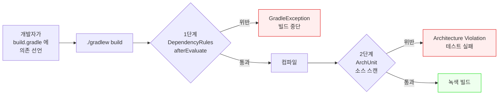

# Repository Philosophy

이 문서는 `spring-backend-template` 이 **왜 현재의 구조를 가지게 되었는지** 설명합니다.

각 결정은 추상적인 이론이 아니라 **솔로 인디 개발자가 여러 앱을 빠른 주기로 출시할 때 마주치는 구체적인 고통** 에 대한 답변으로 만들어졌어요. 이 문서를 읽고 나면 "왜 굳이 이렇게 복잡하게 만들었지?" 하는 의문이 풀리기를 바랍니다.

---

## 프롤로그 — 배경 및 철학

### 맥락: 앱 공장 전략

이 레포지토리는 **"한 사람이 여러 앱을 고 cadence 로 찍어내는"** 작업 방식을 전제로 합니다. 이 한 문장이 단순해 보이지만, 실제로 펼쳐 보면 다음 세 가지 제약이 자동으로 따라붙어요.

#### 제약 1 — 운영 가능성이 최우선

한 사람이 10개 앱을 동시에 운영한다고 상상해봅시다. 앱 1개당 **운영 부담이 조금만 커져도** 전체가 무너집니다. 예를 들어 앱마다:

- 독립된 Spring Boot 서버 1개 = 10개 프로세스
- 독립된 배포 파이프라인 1개 = 10개 CI/CD
- 독립된 모니터링 대시보드 1개 = 10개 Grafana
- 독립된 Postgres 인스턴스 1개 = 10개 DB 관리

여기에 각 앱의 **장애 대응** 까지 더하면 솔로로는 감당 불가능한 수준이 됩니다. 그래서 이 프로젝트는 "기술적으로 멋있는가" 보다 **"솔로가 감당 가능한가"** 가 설계 기준입니다. 멋있지만 복잡한 구조는 기각, 단순하지만 안정적인 구조는 채택.

#### 제약 2 — 시간이 가장 희소한 자원

돈은 **0에 가깝게 만들 수 있습니다** — Supabase Free tier, 맥미니 홈서버, Cloudflare Tunnel, NAS MinIO 조합이면 월 고정 비용이 한 자릿수 달러. 하지만 개발자 1명의 시간은 **복제 불가능한 자원** 이에요.

이 비대칭성이 설계에 직접 반영됩니다:

- 매번 재구현되는 공통 작업 (인증, 유저 관리, 푸시, 결제) 은 **반드시 한 번만 잘 만들고 재사용**
- 새 앱 추가는 **스크립트 한 줄** (`./tools/new-app/new-app.sh <slug>`) — 수동 셋업 금지
- 문서 작성에 들어가는 시간도 비용이므로, 코드 자체가 읽기 쉽게 (**"코드가 문서"** 원칙)

시간을 아끼는 모든 설계 결정이 여기서 출발합니다.

#### 제약 3 — 복권 사기 모델

인디 앱 하나가 **성공할 확률은 낮습니다**. 경험적으로 80%는 시장 반응이 없고, 15%는 그럭저럭 굴러가며, 5%만 의미 있는 트래픽을 얻어요. 하지만 **새 앱 출시 비용이 0에 가까우면** 많이 시도할 수 있습니다.

복권 사기로 비유하면: 당첨 확률은 낮아도 **한 장의 가격이 100원** 이면 1만 장을 살 수 있어요. 반대로 한 장이 10만원이면 3장도 못 삽니다. 이 프로젝트의 존재 이유는 **새 앱 출시 비용을 극단적으로 낮추는 것** — 앱 하나 만드는 데 며칠이 아니라 몇 시간 수준으로 압축하는 게 목표입니다.

### 이 세 제약이 모든 ADR 의 공통 전제

이 세 제약을 내재화하고 나면, 뒤따르는 ADR 들의 **"왜 이 선택이 되었는가"** 가 자연스럽게 이해됩니다. 거꾸로 이 제약을 모른 채 ADR 만 읽으면 "왜 굳이 이렇게 복잡하게?" 하는 의문이 끝없이 생겨요.

예를 들어:

- [ADR-001](#adr-001) 이 "모듈러 모놀리스" 를 선택한 이유는 제약 1 (운영 단위 1 유지) 때문
- [ADR-002](#adr-002) 가 "Use this template + cherry-pick" 을 선택한 이유는 제약 2 (공통 코드 재사용) 때문
- ADR-007 이 "관리형 서비스 선호" 를 선택한 이유는 제약 1 + 제약 2 의 결합
- ADR-008 이 "API 버전 관리 미도입" 을 결정한 이유는 제약 3 (작은 스케일이라 아직 불필요)

**모든 결정이 이 세 제약의 세 가지 조합에서 나옵니다.** 프롤로그를 먼저 읽어두면 이후 ADR 독해 속도가 2배 빨라질 거예요.

---

## 이 문서의 사용법

이 문서는 **16개의 ADR (Architecture Decision Record)** 카드로 구성되어 있습니다. 각 카드는 하나의 설계 결정을 다뤄요. 전체를 순서대로 읽는 것이 가장 좋지만, 독자의 상황과 목적에 따라 진입점이 달라질 수 있어요.

### 독자별 추천 경로

**처음 이 레포를 만난 분**  
위 프롤로그 → 테마 1 ([ADR-001](#adr-001) ~ [ADR-004](#adr-004)) 순서대로 읽기. 테마 1 만 읽어도 "이 레포가 어떻게 생긴 건지" 대부분 이해됩니다. 나머지 테마는 필요해질 때 찾아와요.

**Spring Boot 경력이 있고 설계 결정만 빠르게 훑고 싶은 분**  
각 ADR 의 **Status + Decision + Consequences** 섹션만 읽으세요. 이 세 섹션을 합치면 "뭐를 결정했고, 그 결과가 어떤가" 가 5분에 파악됩니다. Context / Options Considered 는 "왜 다른 선택을 안 했나" 가 궁금해질 때 돌아오세요.

**"왜 이렇게 만들었는지" 가 궁금한 분**  
각 ADR 의 **Context + Options Considered + Lessons Learned** 를 읽으세요. 이 세 섹션이 결정의 **배경과 시행착오** 를 담고 있습니다. 기술 책 스타일로 깊이 있게 써 있어서 개발 철학 에세이처럼 읽힙니다.

**특정 문제에 부딪혀서 해결책 찾는 분**  
아래 "어떤 질문에 어떤 ADR?" 매핑 표로 바로 점프하세요.

### 어떤 질문에 어떤 ADR?

| 이 질문이 궁금하다면 | 이 ADR 을 읽으세요 |
|---|---|
| "여러 앱을 어떻게 한 서버에 올리지?" | [ADR-001](#adr-001) (모듈러 모놀리스) |
| "파생 레포끼리 공통 코드를 어떻게 동기화하지?" | [ADR-002](#adr-002) (Use this template) |
| "나중에 특정 앱을 별도 서비스로 빼려면?" | [ADR-003](#adr-003) (`-api` / `-impl` 분리) |
| "경계를 어떻게 기계적으로 강제하지?" | [ADR-004](#adr-004) (Gradle + ArchUnit) |
| "앱마다 DB 를 따로 쓰나, 하나를 공유하나?" | ADR-005 (단일 DB + 앱별 schema) |
| "JWT 서명은 어떤 알고리즘?" | ADR-006 (HS256) |
| "결정 내릴 때 어떤 기준으로 판단하나?" | ADR-007 (솔로 친화적 운영) |
| "API 버전 관리는 언제 도입하지?" | ADR-008 (미도입 근거) |
| "엔티티 공통 필드를 어떻게 처리하지?" | ADR-009 (BaseEntity) |
| "목록 조회 검색 조건을 표준화하려면?" | ADR-010 (SearchCondition) |
| "모듈 내부 구조는 어떻게 잡나?" | ADR-011 (레이어드 + 포트/어댑터) |
| "통합 계정인가 앱별 계정인가?" | ADR-012 (앱별 독립 유저) |
| "인증 엔드포인트 경로는?" | ADR-013 (앱별 인증 엔드포인트) |
| "테스트는 어떻게 쓰나?" | ADR-014 (Delegation mock 금지) |
| "커밋 메시지 규칙은?" | ADR-015 (Conventional Commits) |
| "DTO 변환은 어떻게 하나?" | ADR-016 (Mapper 없이 Entity 메서드) |

### ADR 카드의 읽는 법

각 카드는 다음 섹션으로 구성돼 있어요:

- **Status** — 현재 유효한지, 언제 정해졌는지
- **한 문장 직관** — 30초 안에 핵심 잡기
- **Context** — 이 결정이 답해야 했던 물음
- **Options Considered** — 검토된 대안과 탈락 이유
- **Decision** — 실제 채택된 안과 구현
- **Consequences** — 긍정/부정 결과 모두 정직하게
- **Lessons Learned** — 사후에 드러난 교훈 (있을 때만)
- **관련 사례 (Prior Art)** — 업계의 유사 접근
- **Code References** — 실제 구현 파일 링크

각 섹션은 독립적으로 읽을 수 있도록 쓰여 있습니다. 필요한 섹션만 골라 읽어도 되고, 궁금하면 전체를 순서대로 읽어도 좋아요. 본인의 필요에 맞게 활용하세요.

---

## 테마 1 — 레포지토리 구조의 기반

### 이 테마가 답하는 물음

**"솔로 개발자가 여러 앱을 감당 가능한 레포지토리 구조는 어떤 모양인가?"**

이 질문 하나에 답하기 위해 4개의 결정이 연쇄적으로 이어집니다. 각 결정이 혼자서는 완전하지 않고, 서로 맞물려야 전체 구조가 성립해요.

### 이 테마의 4개 결정이 서로 엮이는 방식

```
     ┌─────────────────────────────────────────────────┐
     │                                                 │
     ▼                                                 │
ADR-001 (모듈러 모놀리스)                              │
  "한 JAR 에 여러 앱, 그러나 경계 있음"                │
     │                                                 │
     │ 경계가 어디에?                                  │
     ▼                                                 │
ADR-002 (Use this template)                            │
  "도메인 경계는 레포 수준. 공통은 원본, 도메인은 파생"│
     │                                                 │
     │ 공통 코드의 미래 확장성은?                       │
     ▼                                                 │
ADR-003 (-api / -impl 분리)                            │
  "미래 추출 가능성을 위한 포트 인터페이스"            │
     │                                                 │
     │ 위 3가지를 실제로 지키려면?                      │
     ▼                                                 │
ADR-004 (Gradle + ArchUnit 강제) ────────────────────┘
  "컨벤션을 기계가 강제. 문서 신뢰성 유지"
```

각 화살표가 "이 결정을 해결하려면 다음 결정이 필요하다" 의미입니다. 마지막 [ADR-004](#adr-004) 가 앞 3개의 결정을 **실제로 지켜지도록 기계 강제** 하면서 고리가 닫혀요.

**읽는 순서**: [ADR-001](#adr-001) → [ADR-002](#adr-002) → [ADR-003](#adr-003) → [ADR-004](#adr-004). 이 순서로 읽으면 "왜 ADR-004 가 필요한가" 가 자연스럽게 보입니다.

---

<a id="adr-001"></a>
## ADR-001 · 모듈러 모놀리스 (Modular Monolith)

**Status**: Accepted. 현재 유효. 2026-04-20 기준 22개 ArchUnit 규칙 + 5개 Gradle convention plugin 으로 정교화 완료.

### 한 문장 직관

모듈러 모놀리스는 **같은 Postgres 인스턴스 안에 여러 schema 를 두는 구조** 와 같은 원리입니다. 공용 엔진(JVM / DB 프로세스) 은 한 벌로 두되, 그 안에서 각 영역(앱 모듈 / schema) 은 서로의 경계를 넘을 수 없게 만드는 거예요. Kubernetes 에서 같은 클러스터에 여러 namespace 를 두는 구조도 같은 아이디어입니다. **"한 프로세스 안의 격리 구획"** — 이것이 이 결정의 핵심입니다.

> 참고로 이 프로젝트는 실제로 ADR-005(DB 전략) 에서 같은 원리를 데이터 레이어에 한 번 더 적용합니다. 한 Postgres 에 여러 앱 schema 를 두는 것 자체가 "모듈러 모놀리스 패턴" 의 DB 버전인 셈입니다.

### Context — 이 결정이 답해야 했던 물음

프롤로그에서 그려 둔 `앱 공장 전략` 을 떠올리면, 이 결정이 어디서 출발했는지 보입니다. 솔로 개발자 한 명이 여러 앱을 빠르게 출시하려는 상황 — 그 위에서 **서로 다른 방향의 두 힘** 이 동시에 밀고 당깁니다.

**힘 A — 운영 부담 압축**  
앱 1개당 독립 백엔드라면 N개 프로세스, N개 배포 파이프라인, N개 모니터링 대시보드가 필요합니다. 솔로가 10개 앱을 감당하려면 **운영 단위가 1** 이어야 합니다. 프로세스도 하나, 배포도 하나, 새벽에 알림 받을 모니터링도 하나.

**힘 B — 코드 경계 유지**  
앱 간 코드가 섞이기 시작하면 나중에 **어느 하나도 떼어낼 수 없게** 됩니다. 특정 앱이 성공해서 독립 서비스로 추출해야 할 시점이 왔을 때 — 예컨대 MAU 100만을 넘겨서 자기 인프라가 필요해진 순간 — **경계가 있어야** 추출이 가능합니다. 경계 없이 섞이면 "그땐 그때 가서" 가 불가능해져요. 호출 지점이 수백 군데라서요.

두 힘은 얼핏 상충해 보입니다. "운영을 하나로" 하려면 모든 코드가 한 곳에 있어야 하고, "경계를 유지" 하려면 분리되어야 하니까요. 이 결정이 답해야 했던 물음이 바로 이것입니다.

> **운영은 한 벌이지만 구조는 N개** 로 동시에 유지할 수 있는가?

### Options Considered

아래 4가지 선택지를 검토했고, 그중 4번을 채택했습니다.

#### Option 1 — 마이크로서비스 (앱당 독립 백엔드)

각 앱이 독립된 Spring Boot 서비스. 공통 코드는 라이브러리로 공유.

- **장점**: 진짜 프로세스 격리. 앱 A 의 OOM 이 앱 B 에 전혀 영향 없음. 독립 배포 / 독립 스케일링 / 독립 JDK 업그레이드 가능.
- **단점**: 10개 서비스 = 10개 배포 파이프라인 + 10개 Prometheus scrape target + 10개 Postgres connection pool + 10개 TLS 인증서 관리. **솔로 감당 불가 스케일**.
- **추가 문제**: "상태를 가진 공통 기능" (유저 테이블, 결제 테이블) 을 라이브러리로 해결하지 못합니다. 라이브러리는 로직을 공유할 뿐 DB 를 공유하지 않으므로, 각 앱이 결국 자기 `users` 테이블을 복제해야 합니다 — 드리프트 발생.
- **탈락 이유**: 힘 A 를 정면 위반.

#### Option 2 — 단일 Spring Boot + 폴더만 분리 (비모듈화)

하나의 Gradle 프로젝트. `apps/app-a/`, `apps/app-b/` 폴더로 코드만 나눔.

- **장점**: 가장 단순. 초기 셋업 거의 0.
- **단점**: Java 는 **폴더 구조와 의존 관계가 무관** 합니다. `apps/app-b/` 안의 클래스에서 `import com.factory.apps.app_a.SomeUtility` 가 그냥 컴파일됩니다. 한 번이라도 실수로 얽히기 시작하면 **분리가 사실상 불가능** 해져요. 경계가 오로지 **사람 의지** 에만 기대는 구조.
- **탈락 이유**: 힘 B 를 정면 위반. 솔로 개발자에게 특히 위험합니다 — PR 리뷰어가 없으니 실수가 누적돼도 아무도 지적하지 않아요.

#### Option 3 — 공통 코드를 JAR 라이브러리 + 앱당 독립 백엔드

`core-*` 를 별도 레포의 라이브러리로 발행, 각 앱이 버전 고정해서 의존.

- **장점**: 공통 코드 재사용 + 앱 격리 동시 달성.
- **단점 1**: 라이브러리 발행 오버헤드 (Maven Central 이든 사내 레포든) 가 **공통 코드 개선할 때마다** 발생. "한 줄 수정 → 발행 → 각 앱에서 버전 올림 → 테스트" 의 전체 사이클이 솔로에겐 부담.
- **단점 2**: Option 1 과 같은 "공통 상태" 문제를 해결하지 못합니다. 라이브러리는 `users` 테이블을 가질 수 없으므로 각 앱이 다시 자기 유저 테이블을 만들어야 합니다.
- **탈락 이유**: Option 1 의 운영 부담 + 라이브러리 유지 부담이 이중으로 붙음.

#### Option 4 — 모듈러 모놀리스 ★ (채택)

하나의 Spring Boot JAR 안에 **Gradle 모듈 단위로 격리된** 여러 앱이 공존. 모듈 경계는 **빌드 시스템 + ArchUnit** 으로 기계에 의해 강제.

- **힘 A 만족**: 1 JAR = 1 JVM = 1 배포 = 1 모니터링.
- **힘 B 만족**: Gradle 모듈 선언이 의존을 물리적으로 차단. 사람 의지가 아닌 `GradleException` 이 얽힘을 막음.
- **공통 상태 해결**: 같은 JVM 안에서 메서드 호출로 통신 (HTTP 오버헤드 0).
- **미래 추출 경로 보장**: [ADR-003](#adr-003) (`-api` / `-impl` 분리) 덕분에 특정 앱이 HTTP 서비스로 빠질 때 **인터페이스는 그대로, 구현만 HTTP 클라이언트로** 교체하면 됩니다 — 앱 코드 변경 0.

단점도 분명히 존재하지만 감당 가능한 수준입니다. 이건 Consequences 에서 상세히 짚어요.

### Decision

모듈러 모놀리스를 채택하되, **경계 강제를 2단계로 중첩** 합니다. 각 단계는 서로 다른 종류의 실수를 잡아요.

#### 모듈 구성 한눈에



화살표가 향하는 방향으로만 의존이 허용됩니다. 반대 방향은 모두 빌드 실패. 예를 들어 `apps` 가 `coreImpl` 로 화살표를 쏘려고 하면 즉시 차단됩니다 (아래 1단계).

#### 1단계 — Gradle 모듈 경계 (빌드 시 차단)

모듈 타입마다 허용되는 의존 패턴을 미리 정의하고, 위반 시 **빌드 실패** 시키는 convention plugin 체계입니다. 총 5가지 모듈 타입이 있습니다.

| 모듈 타입 | Plugin | 허용 | 금지 |
|---|---|---|---|
| `common-*` | `factory.common-module` | 다른 `common-*` | `core-*`, `apps/*` |
| `core-*-api` | `factory.core-api-module` | `common-*`, 다른 `core-*-api` | 그 외 모든 project 의존 |
| `core-*-impl` | `factory.core-impl-module` | `common-*`, `core-*-api` | **다른 `core-*-impl`** (중요) |
| `apps/app-*` | `factory.app-module` | `common-*`, `core-*-api` | `core-*-impl`, **다른 `apps/*`** |
| `bootstrap` | `factory.bootstrap-module` | 모든 것 | — (단일 엔트리) |

각 모듈의 `build.gradle` 최상단에서 해당 plugin 을 한 줄로 선언합니다.

```gradle
// core/core-auth-api/build.gradle
plugins {
    id 'factory.core-api-module'
}

dependencies {
    api project(':common:common-web')
    api project(':core:core-user-api')  // 다른 core-api 는 허용
    // api project(':core:core-user-impl')  // ← 이 줄이 있으면 빌드 fail
}
```

위반 감지는 [`DependencyRules.groovy`](https://github.com/storkspear/spring-backend-template/blob/main/build-logic/src/main/groovy/com/factory/DependencyRules.groovy) 가 `afterEvaluate` 단계에서 수행합니다. `ProjectDependency` 인스턴스들의 `path` 를 검사해서 `forbiddenPattern` 에 매치되거나 `allowedPrefixes/Exact/Pattern` 어디에도 해당하지 않으면 `GradleException` 을 throw 합니다. 이 검증은 `main` configuration 에만 적용돼요 — `testImplementation` / `testFixtures` 는 교차 의존이 필요한 경우가 있어 스펙상 예외입니다.

#### 2단계 — ArchUnit 런타임 검증 (소스 스캔)

1단계가 "의존성 선언" 을 잡는다면, 2단계는 **실제 바이트코드의 타입 참조** 를 잡습니다. 예컨대 "선언은 안 했지만 reflection 으로 클래스를 가져오는" 종류의 얽힘을 검증합니다.

canonical 규칙은 [`ArchitectureRules.java`](https://github.com/storkspear/spring-backend-template/blob/main/common/common-testing/src/main/java/com/factory/common/testing/architecture/ArchitectureRules.java) 에 22개 public static final ArchRule 상수로 정의돼 있습니다. 규칙 1~5 가 이 결정과 직접 연관돼요.

```java
public static final ArchRule APPS_MUST_NOT_DEPEND_ON_CORE_IMPL =
    noClasses()
        .that().resideInAPackage("..apps..")
        .should().dependOnClassesThat().resideInAPackage("..core..impl..")
        .allowEmptyShould(true)
        .as("r1: apps/* must not depend on core-*-impl (ports only)");

public static final ArchRule APPS_MUST_NOT_DEPEND_ON_EACH_OTHER =
    slices()
        .matching("com.factory.apps.(*)..")
        .should().notDependOnEachOther()
        .allowEmptyShould(true)
        .as("r2: apps/* must not depend on each other");
// ... r3~r22
```

`allowEmptyShould(true)` 는 **template 상태** (apps 모듈이 0개) 를 지원하기 위한 flag 입니다. "검사할 클래스가 0개" 라고 해서 테스트 실패시키지 않고 vacuously true 로 통과시켜요. 파생 레포에서 apps 가 추가되면 자동으로 규칙이 활성화됩니다.

실제 스캔은 `bootstrap` 모듈의 test classpath 에서 이루어집니다 ([`BootstrapArchitectureTest.java`](https://github.com/storkspear/spring-backend-template/blob/main/bootstrap/src/test/java/com/factory/bootstrap/BootstrapArchitectureTest.java)). `@AnalyzeClasses(packages = "com.factory")` 로 common-*, core-*, bootstrap 을 전부 스캔해요. bootstrap 이 모든 모듈을 `implementation` 으로 의존하므로 단일 classpath 에 모든 클래스가 모여있어 이 스캔이 가능합니다.

#### 2단계 방어의 흐름



두 단계는 서로 다른 실수를 잡습니다.

- **1단계만 있으면**: `build.gradle` 선언은 깨끗한데 소스에서 `Class.forName()` 같은 reflection 으로 타인 모듈 클래스를 끌어오는 경우를 못 잡음.
- **2단계만 있으면**: 소스 참조는 없지만 `runtime` / `compileOnly` 로 잘못 선언한 의존이 배포 아티팩트에 들어가는 경우를 빌드 시간에 못 잡음.

두 단계가 중첩되어 **선언 실수** 와 **사용 실수** 를 각각 차단합니다.

#### Counter-example — 실제로 위반하면 어떻게 막히나

이론만 들으면 감이 잘 안 올 수 있어서, 실제 차단 메시지를 같이 보는 게 좋아요.

**Case 1 — `apps/app-sumtally/build.gradle` 에 실수로 `core-auth-impl` 의존 선언**

```gradle
// apps/app-sumtally/build.gradle (잘못된 선언)
dependencies {
    implementation project(':core:core-auth-impl')  // 금지된 의존
}
```

`./gradlew :apps:app-sumtally:compileJava` 실행 시:

```
[factory] Dependency rule violation
  module : :apps:app-sumtally
  config : implementation
  depends: :core:core-auth-impl
  reason : forbidden pattern
See docs/conventions/module-dependencies.md

> FAILURE: Build failed with an exception.
```

컴파일 단계 이전 `afterEvaluate` 에서 차단되어 **클래스 파일 자체가 만들어지지 않습니다**. 개발자는 즉시 `core-auth-api` 만 의존하도록 수정해야 해요.

**Case 2 — reflection 으로 우회 시도 (1단계 통과 후 2단계에서 차단)**

```java
// apps/app-sumtally/src/main/java/.../SomeController.java
Class<?> impl = Class.forName("com.factory.core.auth.impl.EmailAuthServiceImpl");
```

이건 `build.gradle` 의존 선언에 없어도 컴파일됩니다 (reflection 은 문자열). 하지만 ArchUnit 이 컴파일된 바이트코드를 스캔해서 타입 참조를 찾아냅니다.

```
Architecture Violation [Priority: MEDIUM] - Rule 'r1: apps/* must not depend on
core-*-impl (ports only)' was violated (1 times):
Method <com.factory.apps.sumtally.SomeController.doSomething()> references
class <com.factory.core.auth.impl.EmailAuthServiceImpl> via
Class.forName in (SomeController.java:42)

> Task :bootstrap:test FAILED
```

CI 에서 빨간불이 뜨고 merge 가 차단됩니다. 1단계 우회를 2단계가 잡아내는 것이 보이는 구조예요.

### Consequences

#### 긍정적 결과

**운영 단위 1** — `./gradlew :bootstrap:bootRun` 한 줄이 모든 앱을 기동합니다. 배포도 1 JAR, 롤백도 1 JAR. 모니터링 대시보드도 Spring Boot Actuator 하나. 솔로가 감당 가능한 수준이 유지됩니다.

**공유 인프라의 상태 유지** — 같은 JVM 이므로 HikariCP 커넥션 풀, JPA 엔티티 매니저, Spring Security 필터 체인을 앱 간에 공유(또는 분리)하는 선택을 제로 오버헤드로 할 수 있습니다. Option 1 의 마이크로서비스였다면 각 앱이 자기 풀을 따로 열어야 해요.

**모듈 경계가 기계에 의해 강제** — 5개 convention plugin + 22개 ArchUnit 규칙이 경계를 **사람 의지** 로부터 분리합니다. 솔로 개발자가 피곤한 날에도 실수로 얽힘이 들어가지 않아요. PR 리뷰어가 없어도 CI 가 대신합니다.

**추출 경로 보장** — 특정 앱이 성공해서 독립 서비스로 가야 할 때 필요한 것은 "AuthServiceImpl (같은 JVM)" 을 "AuthHttpClient (HTTP 클라이언트)" 로 교체하는 것뿐입니다 — [ADR-003](#adr-003) 의 포트/어댑터 패턴 덕분. 추출을 위한 수백 곳 리팩토링 대신 구현 1개 교체로 끝납니다.

#### 부정적 결과

**단일 JVM 장애 = 전체 장애** — 앱 하나의 OOM 이나 infinite loop 가 전체 JVM 을 죽입니다. 완화책은:
- Spring Boot Actuator 의 health endpoint 로 빠른 감지
- Resilience4j 서킷 브레이커로 앱 간 cascading 차단
- Kamal 의 blue/green 배포로 다운타임 30초 내로 격리
- 특정 앱이 실제로 빈번하게 장애 일으키면 그 시점에 해당 모듈만 추출 ([ADR-003](#adr-003) 경로 활용)

**Memory footprint 선형 증가** — 앱 10개면 엔티티 매니저 10 세트, HikariCP 풀 10개, Spring Security 필터 체인 10벌이 한 JVM 안에 공존. 모니터링 지표 중 `jvm_memory_used_bytes` 가 앱 수에 비례해서 성장합니다. 맥미니급 호스트(16GB~32GB) 에서 안전한 앱 수는 대략 **10~15개** 로 추정.

**JDK / Spring Boot 업그레이드의 전체 동반** — 한 앱만 JDK 25 로 먼저 올리거나 Spring Boot 4.0 으로 먼저 가는 것이 불가능합니다. 전체 JVM 이 동시에 올라가야 해요. 우리 스케일에서는 오히려 장점(버전 드리프트가 없음)이지만, 여러 팀이 개입하는 조직에서는 문제가 될 수 있습니다.

#### 감당 가능성 판단

이 부정 결과들은 **감당 가능한 범위** 입니다. 단일 JVM 장애는 서킷 브레이커로 90% 완화되고, 메모리 선형 증가는 인디 스케일(앱당 MAU 1만~10만) 에서는 문제 되지 않으며, 버전 동반 업그레이드는 오히려 드리프트 방지 효과. **특정 앱이 인디 스케일을 넘어가는 순간** (예: MAU 100만) 이 오면 그때 그 앱을 [ADR-003](#adr-003) 경로로 추출하면 됩니다. 추출 가능성이 보장되어 있으니 "모놀리스에 갇히는 것" 은 아니에요.

### Lessons Learned

**2026-04-20 — `core-auth-impl` 의 `AuthController` 를 런타임에서 제거한 사건.**

초기 설계에서는 `core-auth-impl` 안의 `AuthController` 가 `AuthAutoConfiguration` 에 의해 `@Import` 되어 **런타임 bean 으로 등록**되었습니다. 이때 경로는 `/api/core/auth/*` 였고 모든 앱이 이 하나의 Controller 를 공유했어요.

이 구조는 "어느 앱의 인증 요청인지" 를 런타임에 구분해야 해서 `AbstractRoutingDataSource` + `ThreadLocal` 멀티테넌트 라우팅이 필요했습니다. `ThreadLocal` 은 `@Async` / Virtual Thread 환경에서 컨텍스트 소실 문제가 있었고, Spring Security 필터 체인과의 상호작용이 복잡했어요.

이 복잡도가 "모듈러 모놀리스" 의 본래 목표 — **각 앱이 자기 경계 안에서 단순하게 동작** — 와 어긋난다는 것이 드러났고, 2026-04-20 에 `AuthAutoConfiguration` 의 `@Import(AuthController.class)` 가 제거되었습니다. 이제 `core-auth-impl/controller/AuthController.java` 는 런타임 bean 이 아니라 **`new-app.sh` 가 참조하는 스캐폴딩 소스** 로만 존재합니다. 각 앱 모듈이 자기 `<Slug>AuthController` 를 가지며 경로는 `/api/apps/<slug>/auth/*` 입니다. 상세는 ADR-011 (레이어드 + 포트/어댑터), ADR-013 (앱별 인증 엔드포인트) 에서 다룹니다.

**교훈**: 모듈러 모놀리스의 "모듈" 경계는 **앱 간 상호작용이 실제로 어떻게 일어나는가** 까지 반영해야 합니다. 엔드포인트가 공유되면 상태(ThreadLocal) 공유가 따라오고, 결국 "모듈" 이 겉보기만 분리된 상태가 됩니다. 경계는 **코드 분리 + 라우팅 분리** 가 모두 만족되어야 진짜 경계예요.

### 관련 사례 (Prior Art)

같은 문제의식을 다루는 업계 프로젝트가 있어요 — 참고로만 적어둡니다.

- **[Spring Modulith](https://github.com/spring-projects/spring-modulith)** (Spring 공식, Oliver Drotbohm 주도) — Java 패키지 경계를 모듈로 취급하고 ArchUnit 을 내장해 위반을 빌드 시간에 잡습니다. 이 레포의 접근과 매우 유사하지만 Gradle 모듈 분리까지는 가지 않습니다.
- **Shopify "Component-based Modular Monolith"** — 하나의 Rails 모놀리스를 domain component 단위로 쪼개고 component 간 의존을 명시적으로 관리하는 접근. 블로그 "Deconstructing the Monolith" 참조.
- **Martin Fowler "MonolithFirst"** — 새로운 시스템은 모놀리스로 시작하고 필요해질 때 쪼개라는 고전적 조언. 본 결정의 철학적 배경.

### Code References

**모듈 레이아웃**:
- [`settings.gradle`](https://github.com/storkspear/spring-backend-template/blob/main/settings.gradle) — 전체 모듈 include (common × 5, core × 12 = api/impl × 6 pair, bootstrap × 1, apps × 0)
- [`apps/README.md`](https://github.com/storkspear/spring-backend-template/blob/main/apps/README.md) — 현재 앱이 0개임을 명시하는 placeholder

**Convention plugin 5종** (경로: `build-logic/src/main/groovy/`):
- [`factory.common-module.gradle`](https://github.com/storkspear/spring-backend-template/blob/main/build-logic/src/main/groovy/factory.common-module.gradle)
- [`factory.core-api-module.gradle`](https://github.com/storkspear/spring-backend-template/blob/main/build-logic/src/main/groovy/factory.core-api-module.gradle) — `~/:core:core-[a-z]+-api/` 패턴만 허용
- [`factory.core-impl-module.gradle`](https://github.com/storkspear/spring-backend-template/blob/main/build-logic/src/main/groovy/factory.core-impl-module.gradle) — 다른 `core-*-impl` forbiddenPattern
- [`factory.app-module.gradle`](https://github.com/storkspear/spring-backend-template/blob/main/build-logic/src/main/groovy/factory.app-module.gradle) — 다른 `apps/app-*` + `core-*-impl` 이중 금지
- [`factory.bootstrap-module.gradle`](https://github.com/storkspear/spring-backend-template/blob/main/build-logic/src/main/groovy/factory.bootstrap-module.gradle) — `validateDependencies` 호출 없음

**DSL 구현**:
- [`DependencyRules.groovy`](https://github.com/storkspear/spring-backend-template/blob/main/build-logic/src/main/groovy/com/factory/DependencyRules.groovy) (경로: `build-logic/src/main/groovy/com/factory/`) — `validate(project, rules)` 정적 메서드.

**ArchUnit**:
- [`ArchitectureRules.java`](https://github.com/storkspear/spring-backend-template/blob/main/common/common-testing/src/main/java/com/factory/common/testing/architecture/ArchitectureRules.java) — 22 rule canonical definitions
- [`BootstrapArchitectureTest.java`](https://github.com/storkspear/spring-backend-template/blob/main/bootstrap/src/test/java/com/factory/bootstrap/BootstrapArchitectureTest.java) — 전체 스캔 엔트리
- [`ArchitectureTest.java`](https://github.com/storkspear/spring-backend-template/blob/main/common/common-testing/src/test/java/com/factory/common/testing/architecture/ArchitectureTest.java) — 같은 규칙을 common-testing classpath 에서도 검증

**Bootstrap 묶음**:
- [`bootstrap/build.gradle`](https://github.com/storkspear/spring-backend-template/blob/main/bootstrap/build.gradle) — core-*-impl 6개 + common-* 4개 모두 `implementation`. 이 build.gradle 이 "모놀리스가 실제로 어떻게 조립되는가" 의 physical evidence.

---

<a id="adr-002"></a>
## ADR-002 · GitHub Template Repository 패턴 (Use this template)

**Status**: Accepted. 현재 유효. 2026-04-20 기준 `template-v*` 태그 + 자동 Release 워크플로우 + `cross-repo-cherry-pick.md` 가이드 로 정교화 완료.

### 한 문장 직관

이 레포는 **"완성된 프로젝트" 가 아니라 "프로젝트의 출발점"** 입니다. `create-react-app`, `cargo new`, `django-admin startproject` 와 비슷한 위치에 있어요 — 다만 우리만의 아키텍처와 인프라가 이미 녹아있는 출발점. `Use this template` 버튼을 누르면 깨끗한 사본이 만들어지고, **그 사본부터가 실제 개발이 일어나는 곳** 이에요. 원본 레포는 앞으로도 계속 "깨끗한 출발점" 상태를 유지합니다.

> 중요한 구분: 이 레포 자체는 **직접 개발하지 않습니다**. 여기엔 뼈대, 포트 인터페이스, 공통 인프라만 있어요. 실제 비즈니스 로직 — 예를 들어 "가계부 앱의 예산 계산", "운동 앱의 운동 기록" — 은 파생 레포의 영역입니다.

### Context — 이 결정이 답해야 했던 물음

프롤로그의 `앱 공장 전략` 에서 전제된 상황을 조금 구체화해보면, 이런 질문이 떠오릅니다.

**"앱 여러 개를 만든다면, 그 앱들을 한 레포에 다 넣어야 하나? 별도 레포로 가야 하나?"**

처음엔 "한 레포에 다 넣는 게 공통 코드 재사용에 유리해 보인다" 고 생각할 수 있어요. 실제로 모노레포(monorepo) 전략을 쓰는 회사도 많고요. 하지만 솔로 인디 스케일에서는 **한 레포가 여러 도메인을 담는 순간 생기는 문제들** 이 빠르게 드러났습니다.

**문제 1 — 도메인이 섞이면 재사용이 막힌다**  
가계부 앱의 로직을 운동 앱에 그대로 옮길 수 없어요. 도메인 언어, 테이블 구조, UX 패턴 모두 다릅니다. 한 레포에 두 도메인을 섞으면 **어느 쪽도 "깨끗한 출발점" 으로 재사용할 수 없는** 상태가 됩니다.

**문제 2 — 팀 경계가 생기면 운영이 꼬인다**  
외부 팀과 협업할 때 같은 백엔드 서버를 공유할 수 없습니다. 팀 A 의 배포가 팀 B 를 중단시키면 안 돼요. 지금은 솔로지만 **언젠가 특정 앱이 성공해서 팀이 붙을 수 있음** 을 감안하면, 처음부터 레포 경계를 분리해두는 게 안전합니다.

**문제 3 — "출발점은 순수해야 한다"**  
이 레포는 다른 사람도 사용할 수 있는 공개 템플릿입니다. 특정 앱/회사/도메인의 흔적이 박히면 다른 맥락에서 쓸 때 **그 흔적을 지우는 작업부터** 해야 해요. 출발점은 처음부터 **도메인 중립** 이어야 합니다.

이 세 문제를 동시에 피하려면 다음 물음에 답해야 했어요.

> **"공통 코드의 재사용성" 과 "도메인의 독립성" 을 어떻게 둘 다 잡을 것인가?**  
> 공통 코드를 공유하려면 어딘가 한 곳에 있어야 하지만, 도메인은 각자 독립 레포에 있어야 하는데?

### Options Considered

#### Option 1 — 한 레포에 여러 도메인 공존 (모노레포)

`apps/sumtally/`, `apps/rny/`, `apps/gymlog/` 같은 식으로 한 레포에 모든 앱을 넣는 구조. 공통 코드는 `core/` 에.

- **장점**: 공통 코드 수정이 즉시 모든 앱에 반영됨. 리팩토링이 한 PR 로 끝남.
- **단점**:
  - 위 문제 1, 2, 3 모두 정면 위반.
  - 특정 앱의 비즈니스 로직이 다른 앱 코드 옆에 쌓임 — 도메인 언어가 섞임.
  - 한 앱이 배포 사고를 내면 같은 CI 파이프라인에서 다른 앱 PR 도 막힘.
  - 원본 레포를 **공개 템플릿** 으로 쓸 수 없음 — 특정 도메인 코드가 박혀있으니.
- **탈락 이유**: 솔로 인디 전제 (여러 앱을 독립적으로 출시) 와 맞지 않음. Google/Meta 같은 대기업의 모노레포는 강력한 빌드 인프라 + 팀 경계 도구가 있어 가능. 솔로는 감당 불가.

#### Option 2 — GitHub Fork 사용

각 앱은 원본을 Fork 해서 만듦. 원본에 공통 코드 개선이 생기면 upstream 에서 merge.

- **장점**: git 수준에서 원본과 연결됨. 업스트림 변경 추적이 자동 (`git fetch upstream` + `git merge`).
- **단점**:
  - **Fork 는 계정당 1개만** — 한 계정에서 여러 앱 만들면 각 앱이 서로 다른 Fork 가 될 수 없음.
  - Fork 는 "원본에 PR 보낸다" 를 전제한 협업 모델. 우리는 각 파생이 **독립 진화** 하는 것이 목적. 방향이 반대.
  - merge 로 upstream 변경을 자동 반영하면 **원치 않는 변경까지 강제** 됨.
- **탈락 이유**: 협업 방향성이 다름. Fork 는 오픈소스 기여 모델, 우리 필요는 "시작점 복제 모델".

#### Option 3 — 공통 코드를 JAR 라이브러리로 배포

`core-*` 를 `@factory/core-auth@1.0.0` 같은 Maven 의존성으로 발행. 각 앱 레포가 버전 고정해서 의존.

- **장점**: 각 앱이 독립 레포 + 공통 코드는 라이브러리로 공유.
- **단점**:
  - 라이브러리 발행 인프라 (사내 Maven repo 또는 GitHub Packages) 가 추가 운영 부담.
  - 공통 코드 개선마다 "수정 → 라이브러리 발행 → 각 앱에서 버전 올림 → 테스트 → 배포" 사이클.
  - 가장 큰 문제: 라이브러리는 **로직만** 공유합니다. `users` 테이블 같은 **DB 스키마** 와 **Flyway 마이그레이션** 은 라이브러리로 표현 불가.
- **탈락 이유**: 운영 오버헤드 + 공통 DB 스키마 공유 불가능.

#### Option 4 — GitHub "Use this template" + cherry-pick 전파 ★ (채택)

GitHub 의 **Use this template** 기능으로 파일만 복제. 원본과 git 히스토리 단절. 공통 코드 개선은 파생 레포로 **수동 cherry-pick**.

- **장점**:
  - 각 파생 레포가 **완전 독립된 git 히스토리** — 도메인 코드가 원본을 오염시키지 않음.
  - 계정당 무제한 생성 가능 (Fork 의 1개 제한 없음).
  - 파생 레포가 공통 코드 개선을 **선택적으로** 가져올 수 있음.
  - 공통 DB 스키마, Flyway 마이그레이션, 인프라 스크립트 전부 복제됨.
- **단점**:
  - 자동 전파 없음 — 사람이 직접 cherry-pick 해야 함.
  - "내가 어느 버전까지 반영했는가" 추적이 수동.
  - 원본 개선이 여러 커밋에 섞여 있으면 cherry-pick 이 복잡해짐 → **커밋 위생** 이 중요해짐.
- **이 단점들이 감당 가능한 이유**: 전파를 **의도적으로 수동화** 한 것이 **실은 장점**. 자동 전파는 "원치 않는 강제 변경" 을 만듭니다. cherry-pick 은 솔로에게 "이번엔 받지 않겠다" 선택지를 줘요.

##### 왜 "자동 전파를 안 하는 것" 이 장점인가

예를 들어 내가 운영하는 `sumtally-backend` 가 있는데, 원본 `spring-backend-template` 에 "회원 가입 시 이메일 인증을 기본값으로 켜도록" 이 변경되었다고 가정해봅시다. 내 sumtally 는 이메일 인증을 쓰지 않는 소셜 로그인 전용 앱이에요. 자동 전파면 내 앱이 **의도치 않게 회원가입 플로우가 망가집니다**.

cherry-pick 모델에서는 내가 원본 릴리스 노트를 읽고 **"이 변경은 안 가져오겠다"** 를 명시적으로 선택할 수 있어요. 의도성이 복구됩니다.

### Decision

**GitHub "Use this template" 모델을 채택하되, 4가지 장치로 실효성을 확보** 합니다. 단순히 파일 복제만 하면 "어느 버전까지 반영했는지 알 수 없는" 혼돈이 오거든요.

#### 장치 1 — Conventional Commits 강제

모든 커밋이 `<type>(<scope>): <subject>` 형식을 따릅니다. 이유는 **cherry-pick 때 "어느 커밋이 공통 코드 개선인지" 를 기계가 알아볼 수 있게 하기 위함** 입니다.

```bash
# 파생 레포에서 "template v0.3.0 이후 공통 개선만 가져오기"
git log template-v0.3.0..template-v0.4.0 \
  --grep="^feat\|^fix" \
  --oneline -- core/ common/
```

이 명령이 가능하려면 커밋 메시지 형식이 통일되어야 합니다. 그래서 다음 3중 방어선이 있어요:

- **[`.husky/commit-msg`](https://github.com/storkspear/spring-backend-template/blob/main/.husky/commit-msg)** — 로컬에서 `git commit` 순간 검증. 형식 위반 시 커밋 자체 거부.
- **[`.github/workflows/commit-lint.yml`](https://github.com/storkspear/spring-backend-template/blob/main/.github/workflows/commit-lint.yml)** — CI 에서 PR 의 모든 커밋 검증. 로컬 훅을 `--no-verify` 로 우회한 경우도 잡음.
- **[`.github/workflows/pr-title.yml`](https://github.com/storkspear/spring-backend-template/blob/main/.github/workflows/pr-title.yml)** — PR 제목도 같은 형식 강제.

[`commitlint.config.mjs`](https://github.com/storkspear/spring-backend-template/blob/main/commitlint.config.mjs) 가 canonical 규칙. [`.gitmessage`](https://github.com/storkspear/spring-backend-template/blob/main/.gitmessage) 가 에디터 템플릿으로 개발자 학습을 돕습니다.

#### 장치 2 — 템플릿 전체 단위 SemVer + 태그

`template-v<major>.<minor>.<patch>` 형식의 태그. **템플릿 레포 전체** 가 한 단위로 버전 관리됩니다.

```
template-v0.1.0
template-v0.2.0  ← 여기에 auth.isPremium 필드 추가
template-v0.3.0  ← 여기에 push 모듈 추가
template-v0.4.0  ← 여기에 billing 모듈 추가
```

파생 레포 README 최상단에 템플릿 마커 명시:

```markdown
## Template base

Based on [spring-backend-template](https://github.com/<you>/spring-backend-template) `template-v0.3.0`.

Last synced: 2026-04-25
Pending sync: v0.4.0 (auth.isPremium 필요)
```

"내가 지금 어느 버전까지 반영했는가" 를 git 대신 **사람이 읽는 문서** 로 관리. 간단하지만 효과적입니다.

#### 장치 3 — CHANGELOG 강제 업데이트

모든 feat/fix PR 은 [`CHANGELOG.md`](https://github.com/storkspear/spring-backend-template/blob/main/CHANGELOG.md) 의 `[Unreleased]` 섹션 갱신이 필수입니다. [`changelog-check.yml`](https://github.com/storkspear/spring-backend-template/blob/main/.github/workflows/changelog-check.yml) 이 PR 단계에서 검증합니다.

```yaml
# changelog-check.yml 핵심 로직
- name: Check CHANGELOG.md Unreleased section was updated
  if: steps.skip.outputs.skip == 'false'
  run: |
    BASE=${{ github.event.pull_request.base.sha }}
    HEAD=${{ github.event.pull_request.head.sha }}
    DIFF=$(git diff $BASE $HEAD -- CHANGELOG.md)
    if [ -z "$DIFF" ]; then
      echo "::error::feat/fix PR must update CHANGELOG.md '[Unreleased]' section"
      exit 1
    fi
```

`docs:`, `chore:`, `style:`, `ci:` 타입은 skip. 이유는 이 타입들은 **파생 레포 사용자에게 영향 없는 변경** 이라서. 태그가 push 되면 [`release.yml`](https://github.com/storkspear/spring-backend-template/blob/main/.github/workflows/release.yml) 이 해당 버전 섹션을 CHANGELOG 에서 추출해서 GitHub Release 본문으로 자동 등록해요.

#### 장치 4 — Deprecation 유예 기간

Breaking change 를 도입할 때 **최소 1 minor 주기의 Deprecation 기간** 을 거칩니다. 이유는 **파생 레포가 따라올 시간 확보**.

갑작스러운 major bump (v0.3.0 → v1.0.0) 는 파생 레포 관점에서 "나중에 업그레이드 포기" 로 귀결됩니다. 그래서:

1. v0.4.0 에서 `@Deprecated` 표시 + 대체 API 도입 + CHANGELOG 에 마이그레이션 가이드
2. v0.5.0 에서 실제 제거 (major bump)
3. 파생 레포는 v0.4.0 ~ v0.5.0 사이에 마이그레이션

ArchUnit 규칙 r20 (`DEPRECATED_MUST_DECLARE_SINCE_AND_FOR_REMOVAL`) 이 `@Deprecated(since, forRemoval)` 형식을 강제해서 **기계가 읽을 수 있는 메타데이터** 로 남깁니다.

### Counter-example 1 — Fork 와의 실질적 차이

"Use this template 과 Fork 가 뭐가 다른가?" 는 가장 자주 받는 질문이에요.

| 항목 | Fork | Use this template |
|---|---|---|
| 원본과 git 히스토리 연결 | ✅ 연결됨 | ❌ 단절 |
| 계정당 생성 개수 | 1개 | 무제한 |
| upstream 변경 가져오기 | `git merge upstream` 자동 | `git cherry-pick` 선택적 |
| 원본에 PR 보내기 | ✅ 전제된 기능 | ❌ 불가 (연결 없음) |
| 사용 목적 | 오픈소스 기여 | 프로젝트 시작점 복제 |

**우리 상황을 Fork 로 하려고 하면 어떤 일이 벌어지나?**

```bash
# 첫 번째 앱은 OK
$ gh repo fork storkspear/spring-backend-template \
    --repo storkspear/sumtally-backend --clone
# ✅ Fork 생성됨

# 두 번째 앱 시도
$ gh repo fork storkspear/spring-backend-template \
    --repo storkspear/rny-backend --clone
# ❌ You have already forked this repository.
#    You can only create one fork per account.
```

이 한계가 앱 공장 전략의 핵심을 정면 부정합니다. Use this template 은 이 제약이 없습니다.

### Counter-example 2 — "템플릿 순수성" 의 기계 강제 (ArchUnit r7, r8)

"특정 앱 이름을 원본에 박지 않는다" 는 이 ADR 의 절대 금지 규칙 중 하나예요. 이걸 **문서로만** 선언하면 사람이 깜빡하기 쉽습니다. 그래서 [ADR-004](#adr-004) 의 기계 강제 도구 (ArchUnit) 중 **r7, r8** 이 이 원칙을 **바이트코드 수준에서** 차단합니다.

```java
// 규칙 정의 (ArchitectureRules.java)
public static final ArchRule CORE_API_MUST_NOT_DEPEND_ON_APPS =
    noClasses()
        .that().resideInAPackage("com.factory.core.(*).api..")
        .should().dependOnClassesThat().resideInAPackage("com.factory.apps..")
        .allowEmptyShould(true)
        .as("r7: core-*-api must not depend on apps/* (upward direction)");

public static final ArchRule CORE_IMPL_MUST_NOT_DEPEND_ON_APPS =
    noClasses()
        .that().resideInAPackage("com.factory.core.(*).impl..")
        .should().dependOnClassesThat().resideInAPackage("com.factory.apps..")
        .allowEmptyShould(true)
        .as("r8: core-*-impl must not depend on apps/* (upward direction)");
```

**잘못된 코드 예시** — `core-auth-impl` 안에서 "sumtally 앱 전용 로직" 을 참조:

```java
// core/core-auth-impl/src/.../AuthServiceImpl.java (위반)
import com.factory.apps.sumtally.hooks.SumtallyAuthHook;  // ← 특정 앱 이름

@Override
public AuthResponse signUpWithEmail(SignUpRequest request) {
    // ... 공통 가입 로직 ...
    SumtallyAuthHook.onSignUp(user);  // ← sumtally 에만 의존
    return response;
}
```

**ArchUnit r8 차단**:

```
Architecture Violation [Priority: MEDIUM] - Rule 'r8: core-*-impl must not
depend on apps/* (upward direction)' was violated (1 times):
Method <com.factory.core.auth.impl.AuthServiceImpl.signUpWithEmail(SignUpRequest)>
references class <com.factory.apps.sumtally.hooks.SumtallyAuthHook>

> Task :bootstrap:test FAILED
```

**이 규칙이 의미하는 것**:

1. **의존 방향은 항상 `apps → core`** (위에서 아래). 반대 방향 (`core → apps`) 은 core 가 특정 앱에 종속되는 것이라 **재사용성 파괴**. 템플릿이 한 도메인에 물들면 다른 파생 레포에서 그 core 를 못 씀.
2. **앱별 hook 이 필요하면 Dependency Inversion 으로 해결** — core 에 `AuthHook` Port 인터페이스 정의, 각 앱이 구현체를 Spring 빈으로 등록. core 는 Port 만 알고 구현체 이름은 모름. 이건 [ADR-003](#adr-003) 의 포트/어댑터 패턴 그대로 적용.

**고치는 방법**:

```java
// core/core-auth-api/.../AuthHook.java (새로 추가)
public interface AuthHook {
    void onSignUp(UserSummary user);
}

// core/core-auth-impl/.../AuthServiceImpl.java (수정)
private final List<AuthHook> hooks;  // Spring 이 모든 구현체 주입

public AuthResponse signUpWithEmail(SignUpRequest request) {
    // ... 공통 가입 로직 ...
    hooks.forEach(h -> h.onSignUp(user));  // 앱 이름 모름
    return response;
}

// apps/app-sumtally/.../SumtallyAuthHook.java (앱이 구현 제공)
@Component
public class SumtallyAuthHook implements AuthHook {
    @Override
    public void onSignUp(UserSummary user) {
        // sumtally 전용 로직
    }
}
```

이제 core 는 `AuthHook` 인터페이스만 알고, 앱 이름은 모릅니다. r7, r8 통과.

**"문서만으로는 부족" 한 이유를 체감하는 지점** — 이 규칙이 없으면 어느 날 "한 줄만 넣으면 되는데..." 하는 유혹으로 특정 앱 이름이 core 에 들어올 수 있어요. r7, r8 이 이 유혹을 **빌드 단계에서** 차단합니다. 결과적으로 템플릿의 "순수성" 이 사람 의지가 아닌 기계에 의해 보호됩니다.

### Consequences

#### 긍정적 결과

**도메인 격리가 레포 수준으로 물리화** — `sumtally-backend` 와 `rny-backend` 는 완전 별개의 git 레포이며 서로의 존재를 모릅니다. 한쪽의 배포 사고가 다른 쪽에 파급될 수 없어요.

**원본의 순수성 유지** — `spring-backend-template` 은 앞으로도 "깨끗한 출발점" 상태. 새 사용자가 이 레포를 평가할 때 특정 도메인 코드에 혼란받지 않음. ArchUnit r7, r8 이 **기계 강제** 로 이 순수성을 보장.

**전파의 의도성** — 파생 레포가 "이번 변경은 받는다 / 안 받는다" 를 매번 판단할 수 있어요.

**무제한 파생** — 앱 5개든 50개든 같은 원본에서 파생 가능.

#### 부정적 결과

**자동 전파 없음** — 공통 개선을 각 파생 레포로 전파하려면 **사람이 cherry-pick** 해야 함. 완화: [`cross-repo-cherry-pick.md`](https://github.com/storkspear/spring-backend-template/blob/main/docs/journey/cross-repo-cherry-pick.md) 가이드로 절차화.

**커밋 위생의 강제 부담** — "공통 코드 수정" 과 "도메인 수정" 이 한 커밋에 섞이면 cherry-pick 사고. 완화: [`git-workflow.md`](https://github.com/storkspear/spring-backend-template/blob/main/docs/conventions/git-workflow.md) 의 "한 커밋 = 한 논리적 변경" 규칙.

**버전 추적 수동화** — 파생 레포마다 "내가 template-v0.X.Y 까지 반영했다" 를 README 에 직접 적어야 함.

#### 감당 가능성 판단

수동성이 감내할 만한 이유는 **"손 가는 과정이 곧 검토 과정"** 이기 때문입니다. cherry-pick 은 파생 레포 개발자가 매번 "이 변경을 내 앱에 받을까?" 를 판단하게 합니다. 의도적 마찰(deliberate friction) 이 솔로 인디가 여러 앱을 독립 진화시키는 상황에서는 친구 역할을 해요.

### Lessons Learned

**2026 초반 — 파생 레포 전파 실험 초기에 발견한 3가지 함정.**

1. **한 PR 에 공통 코드 + 도메인 코드 섞어 커밋했다가 cherry-pick 할 때 분리 불가능** 했던 사례. 이후 [`git-workflow.md`](https://github.com/storkspear/spring-backend-template/blob/main/docs/conventions/git-workflow.md) 에 "한 커밋 = 한 논리적 변경" 규칙을 명시화.

2. **Breaking change 를 major bump 로 바로 도입**했다가 파생 레포 업그레이드가 "다음 분기로 미뤄진" 사례. 이후 Deprecation 유예 기간 1 minor 의무화. `@Deprecated(since, forRemoval)` 메타데이터를 ArchUnit 으로 강제.

3. **CHANGELOG 를 PR 에 포함시키지 않는 관행** 이 있었는데, 파생 레포가 "뭐가 바뀌었지" 를 찾을 곳이 없어 GitHub Release 만 보고 추측해야 했음. 이후 `changelog-check.yml` 도입.

**교훈**: Use this template 은 **"복제" 가 쉬울 뿐 "동기화" 는 여전히 어렵다**. 동기화 인프라 (커밋 위생, 버전 태그, CHANGELOG, 마이그레이션 가이드) 를 템플릿 자체에 박아두지 않으면 파생 레포들이 **각자 다른 방향으로 표류** 하게 됩니다.

### 관련 사례 (Prior Art)

- **[Cookiecutter](https://github.com/cookiecutter/cookiecutter)** — Python 생태계의 대표 template 도구. 파라미터 주입 (`{{cookiecutter.project_name}}`) 까지 지원해서 복제 시 자동 치환.
- **[create-react-app](https://create-react-app.dev/)** / **[Vite](https://vitejs.dev/)** / **[Nx](https://nx.dev/)** — JS 생태계의 프로젝트 부트스트래핑 도구들. Nx 는 migration schema 로 자동 마이그레이션 지원.

우리는 가장 "수동적이지만 가장 투명한" 선택지를 골랐습니다. 자동화 레이어가 적을수록 파생 레포의 자율성이 커지고, 디버깅이 쉬워져요.

### Code References

**Template 메타데이터** (GitHub 설정):
- GitHub repository settings > General > "Template repository" 체크박스 활성화. **파일로 증거 없음** — GitHub UI 설정.

**Workflows**:
- [`commit-lint.yml`](https://github.com/storkspear/spring-backend-template/blob/main/.github/workflows/commit-lint.yml) — PR 의 모든 커밋 Conventional Commits 검증
- [`pr-title.yml`](https://github.com/storkspear/spring-backend-template/blob/main/.github/workflows/pr-title.yml) — PR 제목 형식 검증
- [`changelog-check.yml`](https://github.com/storkspear/spring-backend-template/blob/main/.github/workflows/changelog-check.yml) — feat/fix PR 은 CHANGELOG 갱신 강제
- [`release.yml`](https://github.com/storkspear/spring-backend-template/blob/main/.github/workflows/release.yml) — `template-v*` 태그 push 시 GitHub Release 자동 생성

**Git 훅 & 설정**:
- [`.husky/commit-msg`](https://github.com/storkspear/spring-backend-template/blob/main/.husky/commit-msg)
- [`commitlint.config.mjs`](https://github.com/storkspear/spring-backend-template/blob/main/commitlint.config.mjs)
- [`.gitmessage`](https://github.com/storkspear/spring-backend-template/blob/main/.gitmessage)

**버전/체인지로그**:
- [`CHANGELOG.md`](https://github.com/storkspear/spring-backend-template/blob/main/CHANGELOG.md)
- [`package.json`](https://github.com/storkspear/spring-backend-template/blob/main/package.json)

**파생 레포 전파 도구**:
- [`docs/journey/cross-repo-cherry-pick.md`](https://github.com/storkspear/spring-backend-template/blob/main/docs/journey/cross-repo-cherry-pick.md)
- [`docs/conventions/git-workflow.md`](https://github.com/storkspear/spring-backend-template/blob/main/docs/conventions/git-workflow.md)

**ArchUnit 템플릿 순수성 강제**:
- [`ArchitectureRules.java`](https://github.com/storkspear/spring-backend-template/blob/main/common/common-testing/src/main/java/com/factory/common/testing/architecture/ArchitectureRules.java) 의 r7, r8, r20

---

<a id="adr-003"></a>
## ADR-003 · core 모듈을 `-api` / `-impl` 로 분리

**Status**: Accepted. 2026-04-20 기준 core × 6 도메인 (user, auth, device, push, billing, storage) 전부 -api/-impl 쌍으로 구성. ArchUnit 9개 규칙 (r6, r9~r11, r13~r15, r17, r21) 이 구조 강제.

### 한 문장 직관

REST API 서버와 클라이언트를 떠올려보세요. 클라이언트는 **API 스펙 (OpenAPI 문서)** 만 알고 HTTP 호출을 합니다. 서버 내부가 PostgreSQL 을 쓰는지 MongoDB 를 쓰는지, Java 로 짜였는지 Go 로 짜였는지 전혀 신경 쓰지 않아요. 같은 원리를 **한 JVM 안의 모듈 간 호출** 에 적용한 것이 `-api` / `-impl` 분리예요. `-api` 모듈은 "스펙과 DTO", `-impl` 은 "내부 구현". 앱 모듈은 스펙만 보고 호출합니다.

> Java 표준 라이브러리로 비유하면 `java.sql.Connection` (인터페이스, 모든 앱이 의존) vs `org.postgresql.jdbc.PgConnection` (구현체, 특정 벤더). 앱은 Connection 만 알고, 실제 구현체는 런타임에 주입. 같은 패턴입니다.

### Context — 이 결정이 답해야 했던 물음

[ADR-001](#adr-001) 에서 "특정 앱이 성공해서 마이크로서비스로 추출할 때 코드 변경 0 으로 가능하다" 고 약속했어요. 이 약속이 **실제로 지켜지려면** 지금 이 시점에서 구조적 장치가 있어야 합니다. 아무 장치 없이 써놓은 코드를 미래에 추출하려고 하면 수백 곳 리팩토링이 필요해요.

구체적인 물음은 이거예요.

> **미래의 추출 가능성을 위해 지금 어떤 구조적 비용을 감내할 것인가?**

여기서 "추출" 이 무엇인지부터 짚어봅시다. 예를 들어 `sumtally` 앱이 폭발적 성장을 해서 **별도 인프라** 가 필요해진 상황을 가정해볼게요. 이때 우리가 원하는 전환 시나리오는 이래요.

**Before** — 현재 (모놀리스):
```java
// apps/app-sumtally/src/.../SomeController.java
@Autowired
private AuthPort authPort;  // 같은 JVM 의 AuthServiceImpl 이 주입됨

public AuthResponse signup(SignUpRequest req) {
    return authPort.signUpWithEmail(req);  // 메서드 호출
}
```

**After** — 추출 후 (마이크로서비스):
```java
// apps/app-sumtally/src/.../SomeController.java
@Autowired
private AuthPort authPort;  // 여전히 AuthPort — 이름 안 바뀜

public AuthResponse signup(SignUpRequest req) {
    return authPort.signUpWithEmail(req);  // 코드 동일!
}
```

위 두 코드는 **완전히 같습니다**. 바뀐 건 단 하나 — `AuthPort` 의 구현체가 `AuthServiceImpl` (같은 JVM) 에서 `AuthHttpClient` (HTTP 호출) 로 교체되었을 뿐이에요. 앱 모듈의 코드는 **한 줄도 바뀌지 않습니다**.

이 시나리오가 실현되려면 **지금 이 시점에서** 앱 모듈이 `AuthPort` 인터페이스만 보고, `AuthServiceImpl` 클래스를 **직접 참조하지 않도록** 강제해야 해요.

만약 앱이 `AuthServiceImpl` 을 직접 import 하고 있었다면, 추출 시점에 두 가지 나쁜 선택만 남습니다.

- **(a) `core-auth-impl` 코드를 복사해서 새 레포로 가져가기** — 두 곳에서 같은 코드를 유지해야 하는 지옥.
- **(b) 모든 `AuthServiceImpl` 호출 지점을 찾아서 HTTP 클라이언트로 교체** — 수십~수백 곳 수동 리팩토링.

두 선택지 모두 **"코드 변경 0" 약속을 깨뜨립니다**.

### Options Considered

#### Option 1 — 단일 `core-auth` 모듈 (api/impl 미분리)

`core-auth/src/main/java/...` 에 인터페이스, 구현, 엔티티, Repository 가 모두 공존.

- **장점**: 모듈 수 절반. 파일 덜 복잡.
- **단점**: 앱이 의존 선언할 때 "인터페이스만 보기" 가 언어 레벨로 강제 안 됨. Java 는 public 클래스면 어디서든 import 가능. 앱이 실수로 `AuthServiceImpl` 을 import 해도 컴파일 성공.
- **탈락 이유**: 추출 가능성 파괴. [ADR-001](#adr-001) 의 약속을 지킬 수 없음.

#### Option 2 — 런타임 전략 패턴 (Spring `@Qualifier`)

단일 모듈 유지하되 `@Primary`, `@Qualifier`, `@Conditional` 같은 Spring 어노테이션으로 런타임 구현체 선택.

- **장점**: 유연성 높음. 런타임에 구현 교체 가능.
- **단점**:
  - **컴파일 타임 보장 없음** — 앱이 `AuthServiceImpl` 을 직접 import 하는 것을 막지 못함.
  - Spring 이 없는 환경 (테스트 등) 에서는 이 강제가 무력화.
- **탈락 이유**: 경계가 런타임 어노테이션에만 의존. 빌드 시스템 수준의 기계 강제력이 없음.

#### Option 3 — Java 9+ 모듈 시스템 (`module-info.java`)

Java 9 에서 도입된 `module-info.java` 로 `exports` 선언한 패키지만 외부 접근 허용.

- **장점**: Java 언어 레벨 강제.
- **단점**: **Spring Boot + Java 9 모듈 시스템 궁합 어려움**. classpath vs module path 혼재 문제. 디버깅 어려움.
- **탈락 이유**: 이론적으로 완벽하지만 Spring Boot 생태계와 궁합이 나빠 실무 채택이 많지 않음.

#### Option 4 — `-api` / `-impl` Gradle 모듈 분리 ★ (채택)

6개 도메인 각각을 `core-<domain>-api` + `core-<domain>-impl` 두 개의 Gradle 모듈로 분리.

- **`-api` 모듈**: 인터페이스 + DTO + Exception 만. JPA 의존 0. Spring 의존 0.
- **`-impl` 모듈**: Spring 빈 + JPA 엔티티 + 비즈니스 로직.
- **앱 모듈**: `-api` 만 의존. `-impl` 은 ArchUnit 규칙 r6 이 금지.

**장점**:
- 컴파일 타임 강제 — `-impl` 의 클래스를 앱에서 import 시도하면 빌드 실패 ([ADR-001](#adr-001) 의 1단계 방어).
- 런타임 강제 — 바이트코드 스캔으로 reflection 우회도 차단 ([ADR-001](#adr-001) 의 2단계 방어).
- 미래 추출 시 `-api` 는 그대로, `-impl` 만 HTTP 클라이언트로 교체.

**단점**:
- 모듈 수 2배 (6개 도메인 → 12 모듈).
- 인터페이스와 구현체 사이의 매핑 파일 관리 필요 (DTO ↔ Entity 변환 등).
- 초기 설정 복잡도 약간 상승.

**채택 이유**: 단점들이 전부 **한 번의 초기 설정 비용** 이고, 장점은 **프로젝트 수명 동안 지속적 가치** (추출 가능성 + 경계 강제).

### Decision

core 6개 도메인 전부 `-api` / `-impl` 쌍으로 분리합니다.

```
core/
├── core-auth-api/   + core-auth-impl/
├── core-user-api/   + core-user-impl/
├── core-device-api/ + core-device-impl/
├── core-push-api/   + core-push-impl/
├── core-billing-api/+ core-billing-impl/
└── core-storage-api/+ core-storage-impl/
```

이 분리를 **실효성 있게** 유지하기 위한 장치 3가지를 덧붙입니다.

#### 장치 1 — Port 인터페이스 패턴

`-api` 모듈의 인터페이스는 `*Port` 접미사를 사용합니다 (Hexagonal Architecture 용어). 실제 예시 ([`AuthPort.java`](https://github.com/storkspear/spring-backend-template/blob/main/core/core-auth-api/src/main/java/com/factory/core/auth/api/AuthPort.java)):

```java
public interface AuthPort {
    AuthResponse signUpWithEmail(SignUpRequest request);
    AuthResponse signInWithEmail(SignInRequest request);
    AuthResponse signInWithApple(AppleSignInRequest request);
    AuthResponse signInWithGoogle(GoogleSignInRequest request);
    AuthTokens refresh(RefreshRequest request);
    void withdraw(long userId, WithdrawRequest request);
    void requestPasswordReset(PasswordResetRequest request);
    void confirmPasswordReset(PasswordResetConfirmRequest request);
    void changePassword(long userId, ChangePasswordRequest request);
    void verifyEmail(VerifyEmailRequest request);
    void resendVerificationEmail(long userId);
}
```

**Port 의 규칙**:
- 파라미터와 반환 타입은 **DTO 만** (`Request` / `Response` / `Tokens` 등). Entity 금지 (r11).
- JavaDoc 에는 **구현 내부 힌트** 까지 포함해도 됨. 하지만 파라미터로 Entity 는 노출 안 함.
- throws 절의 Exception 도 `-api` 모듈의 `exception/` 패키지에 정의 (`AuthException` 등).

#### 장치 2 — Primary / Secondary Adapter 구분

Port 는 두 방향으로 구현됩니다.

**Primary Adapter (Inbound)** — Port 를 **구현하고 비즈니스 로직을 담는** 클래스. Spring 관용에 따라 `*ServiceImpl` 로 명명.

```java
// core/core-auth-impl/.../AuthServiceImpl.java
@Service
public class AuthServiceImpl implements AuthPort {
    private final UserRepository userRepository;
    private final EmailPort emailPort;

    @Override
    public AuthResponse signUpWithEmail(SignUpRequest request) {
        // 비즈니스 로직
    }
}
```

**Secondary Adapter (Outbound)** — **외부 시스템에 연결하는** 구현체. `*Adapter` 로 명명.

```java
// core/core-auth-impl/.../email/ResendEmailAdapter.java
public class ResendEmailAdapter implements EmailPort {
    private final HttpClient httpClient;

    @Override
    public void send(String to, String subject, String htmlBody) {
        // Resend API 호출
    }
}
```

**왜 이 구분이 중요한가**:
- Primary Adapter 는 "우리 시스템의 비즈니스 로직" 을 담음. 테스트가 복잡.
- Secondary Adapter 는 "외부 시스템과의 HTTP/TCP 연결" 만 담음. 테스트는 HttpClient mock 으로 단순.

#### 장치 3 — ArchUnit 9개 규칙이 `-api`/`-impl` 경계 강제

[ADR-001](#adr-001) 의 2단계 방어(ArchUnit 22규칙) 중 **9개가 이 결정과 직접 연관** 됩니다.

| # | 규칙 | 막는 것 |
|---|---|---|
| **r6** | `CORE_API_MUST_NOT_DEPEND_ON_CORE_IMPL` | `-api` 모듈이 `-impl` 을 참조하는 것 |
| **r9** | `CORE_API_MUST_NOT_DEPEND_ON_JPA` | `-api` 가 JPA 에 의존하는 것. **extraction-critical** |
| **r10** | `CORE_API_MUST_NOT_USE_JPA_ANNOTATIONS` | `-api` 에 `@Entity`, `@Table` 등 붙이는 것 |
| **r11** | `PORT_METHODS_MUST_NOT_EXPOSE_ENTITIES` | Port 메서드가 Entity 타입을 노출하는 것 |
| **r13** | `SPRING_BEANS_MUST_RESIDE_IN_IMPL_OR_APPS` | `@Service`, `@Component` 가 `-api` 에 들어가는 것 |
| **r14** | `PORT_INTERFACES_MUST_RESIDE_IN_API` | `*Port` 인터페이스가 `-impl` 에 놓이는 것 |
| **r15** | `SERVICE_IMPL_MUST_RESIDE_IN_IMPL` | `*ServiceImpl` 클래스가 `-api` 에 놓이는 것 |
| **r17** | `REPOSITORIES_MUST_RESIDE_IN_IMPL_REPOSITORY` | `*Repository` 가 `impl.repository` 바깥에 놓이는 것 |
| **r21** | `ENTITIES_MUST_RESIDE_IN_IMPL_ENTITY` | `@Entity` 가 `impl.entity` 바깥에 놓이는 것 |

#### "extraction-critical" 이 무슨 뜻인가 — r9 의 특별함

r9 는 규칙 이름에 **`extraction-critical`** 라벨이 붙어있어요. 이게 왜 특별한지 설명하면 `-api`/`-impl` 분리의 본질이 명확해집니다.

가정: 어느 날 `-api` 모듈이 JPA 에 의존하도록 허용된다고 합시다.

```java
// core-auth-api/AuthPort.java (잘못된 예)
public interface AuthPort {
    User signInWithEmail(SignInRequest request);  // User 는 @Entity
}
```

이 코드는 컴파일됩니다. 하지만 **미래 추출 시점에 치명적 문제** 가 생겨요.

`core-auth-impl` 을 HTTP 서비스로 추출하려면, HTTP 클라이언트 쪽은 `AuthPort` 인터페이스를 가져야 합니다. 그러려면:
- HTTP 클라이언트가 `User` 엔티티 클래스를 가져야 함
- `User` 엔티티는 JPA 의존 (`@Entity`, `@Id`, `@Column`)
- → HTTP 클라이언트 프로젝트가 **JPA 런타임을 전부 가져야 함**

HTTP 클라이언트는 DB 를 안 씁니다. HTTP 로 요청만 보내는데 JPA 를 가져야 한다? 이건 모순이에요. r9 는 이 모순을 **지금 이 시점에서** 차단합니다.

### Counter-example — Entity 누출 시도

**잘못된 코드**:

```java
// core/core-auth-api/.../AuthPort.java (위반)
public interface AuthPort {
    User signInWithEmail(SignInRequest request);  // Entity 반환
}
```

**ArchUnit r11 차단**:

```
Architecture Violation [Priority: MEDIUM] - Rule 'r11: Port methods must not
expose Entity types' was violated (1 times):
Method <com.factory.core.auth.api.AuthPort.signInWithEmail(SignInRequest)>
has return type <com.factory.core.user.impl.entity.User>

> Task :bootstrap:test FAILED
```

**추가로 r6 도 동시 발동** — `core-auth-api` 가 `core-user-impl` 에 의존:

```
Architecture Violation [Priority: MEDIUM] - Rule 'r6: core-*-api must not
depend on core-*-impl' was violated (1 times):
Method <com.factory.core.auth.api.AuthPort.signInWithEmail(SignInRequest)>
references class <com.factory.core.user.impl.entity.User>
```

**고치는 방법**: User 엔티티 대신 `UserSummary` DTO 를 `core-user-api/dto/` 에 정의해서 반환.

### Consequences

#### 긍정적 결과

**추출 1분 컷** — `AuthServiceImpl` 을 `AuthHttpClient` 로 교체하는 Spring 빈 설정 한 줄 수정. 앱 모듈 코드는 건드리지 않음.

**컴파일 타임 경계** — 앱 개발자가 실수로 `-impl` 의 클래스를 import 하려고 하면 Gradle 이 빌드 실패.

**테스트 구조 명확** — 각 앱 모듈의 테스트는 `AuthPort` 를 Mock 으로 주입해서 테스트 가능.

**JPA / Spring 의존성의 격리** — `-api` 는 순수 Java. 미래 추출 시 `-api` 자체가 어느 플랫폼에든 가져갈 수 있음.

#### 부정적 결과

**모듈 수 2배** — 6개 도메인 × 2 = 12 core 모듈. IDE 프로젝트 트리가 길어짐. 완화: 관습으로 짝 구조가 명확해서 탐색은 쉬움.

**DTO ↔ Entity 변환 비용** — Port 가 Entity 반환 금지이므로 `-impl` 내부에서 Entity 를 DTO 로 변환해야 함. 완화: ADR-016 (DTO Mapper 금지, Entity 메서드 패턴) 이 이 비용을 최소화.

**Port 인터페이스가 커지는 경향** — AuthPort 가 현재 **11 메서드** (email 가입 / 이메일·Apple·Google 로그인 / refresh / 탈퇴 / password reset 3개 (요청·확인·변경) / email verify 2개 (검증·재발송)). 이 인터페이스 하나가 "인증 도메인의 전체 수퍼집합" 이 됨. 완화: 인터페이스가 20+ 메서드로 성장하면 그때 `EmailAuthPort`, `SocialAuthPort`, `PasswordResetPort` 같은 **책임 기반 분할** 고려. 현재 11 메서드는 적정 수준.

#### 감당 가능성 판단

단점들은 **초기 설정 비용 + 지속적 약간의 번거로움** 수준입니다. 반면 장점 중 "추출 가능성" 은 **언젠가 큰 위기 순간에 프로젝트를 살리는 보험** 이에요.

### Lessons Learned

**2026-04-20 — `core-auth-impl/controller/AuthController` 의 런타임 등록 해제 사건** ([ADR-001](#adr-001), ADR-011, ADR-013 과 연결).

이 분리 구조에서는 Controller 조차 **Port 의 사용자** 입니다. Controller 는 Port 를 주입받아 호출할 뿐 Port 를 구현하지 않아요. 그래서 Controller 가 `-impl` 에 있는 것 자체는 괜찮았는데, 문제는 **Controller 를 런타임에 어디서 등록할 것인가** 였어요.

처음에는 `core-auth-impl` 의 `AuthAutoConfiguration` 이 `@Import(AuthController.class)` 로 등록 → 공용 `/api/core/auth/*` 경로. 하지만 이 방식은 "모든 앱이 같은 Controller 공유 → 어느 앱 요청인지 런타임 구분 필요 → ThreadLocal + AbstractRoutingDataSource" 라는 복잡도를 불렀어요.

2026-04-20 에 이걸 수정 — `AuthController` 는 이제 `-impl` 에 **스캐폴딩 소스** 로만 존재, 런타임 등록 안 함. 각 앱 모듈이 자기 `<Slug>AuthController` 를 가지며 Port 를 주입받아 사용.

**교훈**: `-api` / `-impl` 분리는 **모듈 내부 책임 경계** 도 재조정하게 만듭니다. "무엇이 Port 구현체인가", "무엇이 Port 사용자인가" 구분이 명확해질수록 런타임 구조도 단순해져요.

### 관련 사례 (Prior Art)

- **[Hexagonal Architecture](https://alistair.cockburn.us/hexagonal-architecture/) (Alistair Cockburn)** — Port / Primary Adapter / Secondary Adapter 용어의 원형.
- **[Clean Architecture](https://blog.cleancoder.com/uncle-bob/2012/08/13/the-clean-architecture.html) (Robert Martin)** — Dependency Inversion 원칙.
- **Java 표준 JDBC — `javax.sql.DataSource` vs 벤더 구현체** — 같은 패턴의 Java 표준 사례.
- **[Spring Modulith](https://github.com/spring-projects/spring-modulith)** — 공식 프로젝트이지만 `-api` / `-impl` 모듈 분리까지는 가지 않고 패키지 경계만 사용.

### Code References

**Port 인터페이스** (모두 `-api` 모듈):
- [`AuthPort.java`](https://github.com/storkspear/spring-backend-template/blob/main/core/core-auth-api/src/main/java/com/factory/core/auth/api/AuthPort.java) — 11 메서드, JavaDoc 풍부.
- [`UserPort.java`](https://github.com/storkspear/spring-backend-template/blob/main/core/core-user-api/src/main/java/com/factory/core/user/api/UserPort.java)
- [`PushPort.java`](https://github.com/storkspear/spring-backend-template/blob/main/core/core-push-api/src/main/java/com/factory/core/push/api/PushPort.java)
- [`EmailPort.java`](https://github.com/storkspear/spring-backend-template/blob/main/core/core-auth-api/src/main/java/com/factory/core/auth/api/EmailPort.java) — 간결. Secondary Adapter 의 대상.

**Primary Adapter** (`-impl` 모듈):
- [`AuthServiceImpl.java`](https://github.com/storkspear/spring-backend-template/blob/main/core/core-auth-impl/src/main/java/com/factory/core/auth/impl/AuthServiceImpl.java)

**Secondary Adapter** (`-impl` 모듈):
- [`ResendEmailAdapter.java`](https://github.com/storkspear/spring-backend-template/blob/main/core/core-auth-impl/src/main/java/com/factory/core/auth/impl/email/ResendEmailAdapter.java)

**Build 의존성 증거**:
- [`core/core-auth-api/build.gradle`](https://github.com/storkspear/spring-backend-template/blob/main/core/core-auth-api/build.gradle) — JPA / Spring 의존 없음.
- [`core/core-auth-impl/build.gradle`](https://github.com/storkspear/spring-backend-template/blob/main/core/core-auth-impl/build.gradle) — JPA / Spring 전체 의존.

**ArchUnit 규칙**:
- [`ArchitectureRules.java`](https://github.com/storkspear/spring-backend-template/blob/main/common/common-testing/src/main/java/com/factory/common/testing/architecture/ArchitectureRules.java) — r6, r9, r10, r11, r13, r14, r15, r17, r21.

**AutoConfiguration**:
- [`AuthAutoConfiguration.java`](https://github.com/storkspear/spring-backend-template/blob/main/core/core-auth-impl/src/main/java/com/factory/core/auth/impl/AuthAutoConfiguration.java) — 추출 시 이 파일이 핵심 교체 지점.

---

<a id="adr-004"></a>
## ADR-004 · Gradle 모듈 경계 + ArchUnit 22규칙으로 의존 강제

**Status**: Accepted. 2026-04-20 기준 [`DependencyRules.groovy`](https://github.com/storkspear/spring-backend-template/blob/main/build-logic/src/main/groovy/com/factory/DependencyRules.groovy) DSL + [`ArchitectureRules.java`](https://github.com/storkspear/spring-backend-template/blob/main/common/common-testing/src/main/java/com/factory/common/testing/architecture/ArchitectureRules.java) 22 규칙 공존.

> **이 ADR 의 범위** — [ADR-001](#adr-001) 에서 "**왜** 2단계 방어가 필요한가" 를, [ADR-003](#adr-003) 에서 "**무엇을** 분리하는가 (-api/-impl)" 를 다뤘어요. 본 ADR 은 **"어떤 도구로 어떻게 강제할 것인가"** 의 도구 선택과 DSL 설계, 그리고 앞에서 안 다룬 나머지 ArchUnit 규칙 (r16, r18~r22) 에 초점을 맞춥니다.

### 한 문장 직관

Python 의 [`ruff`](https://docs.astral.sh/ruff/), TypeScript 의 `tsc --strict`, Rust 컴파일러처럼 **컨벤션을 문서가 아니라 빌드 자체가 강제** 하는 장치입니다. 우리 프로젝트에서 그 역할을 하는 것이 `DependencyRules.groovy` DSL (빌드 시) 과 ArchUnit (소스 스캔 시) 의 조합이에요. 사람이 "이 규칙 지켜주세요" 라고 부탁하는 대신, **규칙 위반 시 빌드가 실패** 하도록 설계했습니다.

### Context — 이 결정이 답해야 했던 물음

[ADR-001](#adr-001) 에서 "2단계 방어" 를 선언했어요. [ADR-003](#adr-003) 에서 "-api/-impl 을 분리해서 추출 가능성을 보장한다" 고 선언했고요. 이 선언들이 **실제로 지켜지려면** 누군가가 규칙 위반을 감지해야 합니다. 이 결정이 답해야 할 물음은 이거예요.

> **컨벤션을 어떤 수단으로 강제할 것인가?**  
> PR 리뷰? Git hook? CI lint? 어느 수준의 강제력이 솔로 인디 스케일에 맞는가?

"모듈 경계를 지켜야 한다" 를 문서에 써놓는 것만으로는 부족합니다. **사람은 실수해요**. 특히 솔로 개발자는 피곤한 새벽에 급한 버그 수정하다가 경계를 넘을 수 있습니다. PR 리뷰어도 없고, 내가 내 코드를 리뷰하면 같은 실수를 놓칠 확률이 높아요. **기계가 대신 막아줘야** 합니다.

### Options Considered

##### Option 1 — PR 리뷰 / 문서에 의존

"conventions/module-dependencies.md 를 읽고 지켜주세요" 같은 방식.

- **장점**: 도구 설치 비용 0.
- **단점**: 솔로 → 리뷰어 없음. 문서 전체를 먼저 읽어야 실수 안 함. 실수가 main 까지 올라간 뒤 한참 지나서야 발견.
- **탈락 이유**: 솔로 인디 환경에서는 강제력이 실질적으로 0.

##### Option 2 — Git pre-commit hook (로컬)

husky 같은 도구로 로컬 커밋 순간 검증.

- **장점**: 가장 빠른 피드백 (커밋 순간).
- **단점**: `git commit --no-verify` 로 우회 가능. CI 환경과 로컬 환경 규칙 동기화 어려움.
- **부분 채택**: 커밋 메시지 검증 ([ADR-002](#adr-002) 의 Conventional Commits) 에는 사용. 하지만 **구조 규칙** 에는 부적합.

##### Option 3 — 전통적 Java lint 도구 (Checkstyle, PMD, SpotBugs)

- **장점**: 성숙하고 안정적. IDE 통합 잘 됨.
- **단점**: 기본 rule set 이 **우리 특화 규칙** (-api/-impl 경계, multi-module 의존) 을 커버 못 함. 커스텀 rule 작성 가능하지만 ArchUnit 보다 유연성 떨어짐.
- **탈락 이유**: 범용 도구라 아키텍처 검증에는 맞춤 도구가 더 나음.

##### Option 4 — Gradle convention plugin + ArchUnit ★ (채택)

빌드 단계 검증 (Gradle) + 소스 스캔 검증 (ArchUnit) 두 레이어를 조합.

- **장점**: 기계 강제 — 우회 어려움. Gradle 은 "의존 선언", ArchUnit 은 "소스 참조" — 각자 잘하는 영역 분담. 커스텀 DSL 설계 가능. 로컬/CI 동기화 보장.
- **단점**: 러닝 커브 (DSL 학습 + Gradle lifecycle + ArchUnit 문법).
- **채택 이유**: 단점은 **초기 설정 비용**. 장점은 프로젝트 수명 동안 지속.

### Decision

`DependencyRules.groovy` DSL + ArchUnit 조합. 두 도구가 **서로 다른 실수** 를 잡도록 역할 분담.

#### 도구 선택의 메타 철학 — 왜 두 도구?

한 도구로 모든 걸 하려고 하면 복잡도가 폭발합니다. 대신 **각 도구가 가장 잘하는 시점** 에서 활약하게 하면 전체 구조가 단순해져요.

| 도구 | 시점 | 잡는 실수 |
|---|---|---|
| **Gradle convention plugin** | Configuration 단계 (컴파일 전) | `build.gradle` 에 금지된 의존 **선언** |
| **ArchUnit** | Test 단계 (컴파일 후) | 소스 코드에서 금지된 클래스 **import / 참조** |

두 도구의 책임이 **겹치지 않습니다**. Gradle 은 "이 모듈이 뭘 의존한다고 선언했나" 를 보고, ArchUnit 은 "실제 .class 파일이 뭘 참조하나" 를 봅니다.

#### DSL 설계 — `DependencyRules.groovy`

DSL 의 핵심 사용 예:

```groovy
// build-logic/src/main/groovy/factory.app-module.gradle
DependencyRules.validate(project, [
    allowedPrefixes : [':common:'],
    allowedPattern  : ~/:core:core-[a-z]+-api/,
    forbiddenPattern: ~/(:core:core-[a-z]+-impl|:apps:app-[a-z]+)/
])
```

4가지 조건 키:

| 키 | 의미 | 예시 |
|---|---|---|
| `allowedPrefixes` | prefix 매치 허용 | `[':common:']` |
| `allowedExact` | 정확 일치 허용 | `[':bootstrap']` |
| `allowedPattern` | regex 허용 | `~/:core:core-[a-z]+-api/` |
| `forbiddenPattern` | regex 금지 (우선 적용) | `~/:core:core-[a-z]+-impl/` |

**설계 의도**: 단순 allowlist 보다 **유연** (정규식 지원). 복잡한 규칙 엔진보다 **간단**. `forbiddenPattern` 우선 적용 → "금지는 절대 금지" 원칙.

#### `afterEvaluate` 타이밍 선택의 이유

Gradle 빌드 lifecycle 은 3단계: **Initialization** → **Configuration** → **Execution**.

`afterEvaluate` 는 **Configuration 끝, Execution 시작 전** 실행되는 훅입니다.

- **너무 빠르면** (`build.gradle` 평가 중): 의존 선언이 아직 완성되지 않아 잘못된 통과 가능.
- **너무 느리면** (Execution 중): 이미 Task 그래프가 실행되기 시작. 실패 시 불필요한 작업 낭비.
- **`afterEvaluate`**: 모든 선언이 확정된 뒤, 아직 아무 Task 가 실행되지 않은 **황금 시간**.

#### `ProjectDependency` 만 타겟팅

DSL 은 외부 Maven 라이브러리 의존을 **검증하지 않습니다**. 외부 라이브러리 경계 관리는 **다른 문제** (`dependency-check`, Snyk). 모듈 경계는 "내 프로젝트 안의 project 간 관계" 만 다룹니다.

#### `test` configuration 예외

DSL 은 `testImplementation`, `testFixturesImplementation` 같은 test 전용 configuration 을 **스킵** 합니다.

```groovy
String name = config.name
if (name.startsWith('test')) return
if (name.startsWith('testFixtures')) return
```

이유: 테스트에서는 **교차 모듈 의존이 필요한 경우** 가 있습니다. 예를 들어 `core-auth-impl` 의 테스트는 `core-user-impl` 의 V001/V002 마이그레이션이 필요 → `testImplementation project(':core:core-user-impl')` 필수. 일반 규칙을 적용하면 테스트 작성 불가능. 이 예외는 [`contract-testing.md`](https://github.com/storkspear/spring-backend-template/blob/main/docs/testing/contract-testing.md) 에 공식화.

#### 나머지 ArchUnit 규칙 (r16, r18~r22) — 네이밍/DTO/메타데이터

[ADR-001](#adr-001) 은 r1~r5 를, [ADR-003](#adr-003) 은 r6~r11, r13~r15, r17, r21 을 다뤘어요. [ADR-002](#adr-002) 는 r7, r8 을 다뤘고요. 여기서는 남은 **r16, r18, r19, r20, r22** 를 소개합니다.

##### r16 — `*Exception` → `..exception..` 패키지

```java
public static final ArchRule EXCEPTIONS_MUST_RESIDE_IN_EXCEPTION_PACKAGE =
    classes()
        .that().haveSimpleNameEndingWith("Exception")
        .and().areNotInterfaces()
        .should().resideInAPackage("..exception..")
        .as("r16: *Exception classes must reside in ..exception.. packages");
```

**목적**: Exception 클래스를 패키지 한 곳에 모아 검색과 관리를 쉽게. 예외 계층이 분산되면 "이 예외가 어떤 도메인 거지?" 가 모호해집니다.

##### r18 — DTO 는 record (또는 sealed interface)

```java
public static final ArchRule DTOS_MUST_BE_RECORDS =
    classes()
        .that().resideInAPackage("..dto..")
        .should(beRecordOrSealedInterface())
        .as("r18: classes in ..dto.. packages must be records (or sealed interfaces)");
```

**목적**: Java 14+ 의 `record` 는 불변성 + 자동 `equals`/`hashCode`/`toString` + 짧은 선언. DTO 에 완벽.

```java
// r18 통과
public record AuthResponse(long userId, String accessToken, String refreshToken) {}

// r18 위반 — 일반 class
public class AuthResponse {
    private long userId;
    // ...
}
```

##### r19 — DTO 네이밍 접미사

```java
public static final ArchRule DTO_NAMING_SUFFIX =
    classes()
        .that().resideInAPackage("..dto..")
        .and().areRecords()
        .should(haveOneOfSuffixes(
            "Request", "Response", "Dto",
            "Summary", "Profile", "Account",
            "Tokens", "Message", "Result", "Status"
        ))
        .as("r19: DTO record names must end with one of the allowed suffixes");
```

**목적**: DTO 이름이 제각각이면 (`UserData`, `AuthInfo`, `TokenBundle` 등) **용도 파악이 어려워** 집니다. 접미사를 제한해서 이름만 보면 용도가 즉시 이해되게. **이름이 곧 문서** 가 되는 규칙.

##### r20 — `@Deprecated` 는 `since` + `forRemoval` 속성 필수

```java
public static final ArchRule DEPRECATED_MUST_DECLARE_SINCE_AND_FOR_REMOVAL =
    members()
        .that().areAnnotatedWith(Deprecated.class)
        .should(haveDeprecatedWithSinceAndForRemoval())
        .as("r20: @Deprecated must declare since and forRemoval");
```

**목적**: [ADR-002](#adr-002) 의 **Deprecation 유예 기간** 을 실천하는 규칙. 단순히 `@Deprecated` 만 붙이면 "언제부터? 언제 제거?" 가 모호. `@Deprecated(since = "0.4.0", forRemoval = true)` 처럼 명시하면 파생 레포가 "내가 지금 v0.3.0 기반인데 이 API 는 v0.4.0 부터 deprecated 니까 아직 사용 가능" 판단 가능.

##### r22 — `*Mapper` 클래스 금지

```java
public static final ArchRule NO_MAPPER_CLASSES =
    noClasses()
        .that().haveSimpleNameEndingWith("Mapper")
        .and().areNotInterfaces()
        .should().bePublic()
        .as("r22: *Mapper classes (non-interface) are forbidden — use Entity to<Dto>() methods instead");
```

**목적**: DTO 변환을 별도 `*Mapper` 클래스로 만들지 말고 **Entity 의 `to<Dto>()` 메서드** 로 하라는 강제. 상세는 ADR-016 에서 다룹니다.

### Counter-example — DSL 타이밍을 잘못 설계하면?

가상 시나리오로 `afterEvaluate` 선택의 이유를 체험해봅시다.

만약 DSL 을 **`beforeEvaluate`** 에서 실행한다고 가정하면:

```groovy
// 가상: beforeEvaluate 로 잘못 설계한 경우
project.beforeEvaluate { p ->
    p.configurations.findAll { ... }.each { ... }
}
```

이때:
- `beforeEvaluate` 는 `build.gradle` 평가 **시작 전**
- `configurations` 블록이 아직 평가되지 않음 → **빈 컬렉션**
- → 어떤 의존도 검증 안 됨, 규칙 무효화

CI 는 녹색인데 실제로는 규칙 위반이 main 까지 올라갑니다.

반대로 **Task 실행 중** 검증하면:
- 컴파일이 이미 시작됨 — 실패 시 캐시 혼란
- 병렬 빌드에서 다른 Task 들이 이미 돌아가고 있을 수도

**`afterEvaluate` 만이** "선언은 확정, 실행은 미시작" 이라는 타이밍을 제공해요.

### Consequences

#### 긍정적 결과

**컨벤션의 사람 의존성 제거** — "규칙 지켜주세요" 가 필요 없음. 규칙 어기면 빌드가 알아서 막습니다.

**규칙 canonical 위치 단일화** — `DependencyRules.groovy` (1 파일) + `ArchitectureRules.java` (1 파일) 두 곳만 보면 **모든 아키텍처 규칙** 확인 가능.

**규칙이 데이터화됨** — `ArchitectureRules.java` 의 22개 `public static final ArchRule` 은 **다른 테스트에서 재사용** 가능. 규칙이 "lint 설정" 이 아니라 **Java 오브젝트** 로 존재.

**확장성** — 새 규칙은 한 줄 추가로 끝.

#### 부정적 결과

**러닝 커브** — DSL + Gradle lifecycle + ArchUnit 문법 세 가지를 이해해야 완전 파악. 완화: 단순해서 건드릴 일 거의 없음.

**ArchUnit 은 bootstrap 테스트에만 의존** — r1~r22 의 실제 스캔은 `BootstrapArchitectureTest` 에서만 완전히 작동. 개별 모듈 테스트에서는 자기 classpath 안의 클래스만 보여서 일부 규칙은 vacuously true. 완화: CI 에서 반드시 `./gradlew :bootstrap:test` 실행.

### Lessons Learned

**2026 초 — `testImplementation` 예외 도입 사건**.

초기 DSL 설계는 **모든 configuration** 을 검증했어요. 문제 발생: `core-auth-impl` 의 `RefreshTokenRepositoryTest` 가 실행되려면 `users` 테이블이 필요 (FK 제약). `users` 테이블은 `core-user-impl` 의 V001 Flyway 마이그레이션이 생성. 따라서 `testImplementation project(':core:core-user-impl')` 필수. 하지만 DSL 은 이를 **`core-impl` 끼리 참조 금지** 위반으로 판단 → 빌드 실패.

두 선택지:
- **(a) 테스트용 마이그레이션 파일을 복사** — 의존 없지만 **드리프트 위험**.
- **(b) DSL 이 test configuration 은 예외로 스킵** — 프로덕션 경계는 유지, 테스트는 실용 우선.

(b) 가 채택됨.

**교훈**: 기계 강제의 엄격함은 **실무 필요** 에 의해 미세 조정되어야 합니다.

#### 또 하나의 교훈 — 규칙을 "번호로" 식별하는 것의 가치

ArchUnit 규칙은 `r1`, `r2`, ..., `r22` 처럼 **번호로** 참조합니다.

- 빌드 실패 시: "`r11 violation: AuthPort.signIn() returns User`" 처럼 **번호가 에러 메시지에 등장** → 번호로 검색해서 어떤 규칙인지 즉시 파악.
- ADR 작성 시: "r9 는 extraction-critical 이고..." 처럼 번호가 **구분자** 역할.

### 관련 사례 (Prior Art)

- **[ESLint `no-restricted-imports`](https://eslint.org/docs/latest/rules/no-restricted-imports)** — JS 생태계에서 비슷한 목적.
- **[Dependency Cruiser](https://github.com/sverweij/dependency-cruiser)** — Node.js 모듈 의존 검증.
- **[Nx Tags & Boundaries](https://nx.dev/concepts/more-concepts/enforce-project-boundaries)** — Nx monorepo.
- **Rust 의 module visibility (`pub`, `pub(crate)`, `pub(super)`)** — 언어 레벨 강제.
- **[Checkstyle](https://checkstyle.sourceforge.io/) / [PMD](https://pmd.github.io/) / [SpotBugs](https://spotbugs.github.io/)** — Java 전통 lint.

### Code References

**DSL 구현 & 사용**:
- [`DependencyRules.groovy`](https://github.com/storkspear/spring-backend-template/blob/main/build-logic/src/main/groovy/com/factory/DependencyRules.groovy)
- [`factory.common-module.gradle`](https://github.com/storkspear/spring-backend-template/blob/main/build-logic/src/main/groovy/factory.common-module.gradle)
- [`factory.core-api-module.gradle`](https://github.com/storkspear/spring-backend-template/blob/main/build-logic/src/main/groovy/factory.core-api-module.gradle)
- [`factory.core-impl-module.gradle`](https://github.com/storkspear/spring-backend-template/blob/main/build-logic/src/main/groovy/factory.core-impl-module.gradle)
- [`factory.app-module.gradle`](https://github.com/storkspear/spring-backend-template/blob/main/build-logic/src/main/groovy/factory.app-module.gradle)

**ArchUnit 규칙 canonical**:
- [`ArchitectureRules.java`](https://github.com/storkspear/spring-backend-template/blob/main/common/common-testing/src/main/java/com/factory/common/testing/architecture/ArchitectureRules.java)
- [`BootstrapArchitectureTest.java`](https://github.com/storkspear/spring-backend-template/blob/main/bootstrap/src/test/java/com/factory/bootstrap/BootstrapArchitectureTest.java)

**관련 스펙 문서**:
- [`docs/conventions/module-dependencies.md`](https://github.com/storkspear/spring-backend-template/blob/main/docs/conventions/module-dependencies.md)
- [`docs/testing/contract-testing.md`](https://github.com/storkspear/spring-backend-template/blob/main/docs/testing/contract-testing.md)

---

## 테마 1 마무리

### 4개 결정이 만들어낸 구조

지금까지 읽은 4개 ADR 을 한 장으로 요약하면 이렇게 됩니다.

| 층위 | 이 층위의 결정 | 제공하는 것 |
|---|---|---|
| **Meta** — 강제 메커니즘 | [ADR-004](#adr-004) | 위 3개 결정이 실제로 지켜지도록 기계 강제 |
| **Future** — 확장 경로 | [ADR-003](#adr-003) | 특정 앱 분리 필요 시 추출 가능성 보장 |
| **Scope** — 도메인 경계 | [ADR-002](#adr-002) | 도메인 코드는 파생 레포, 공통은 원본 |
| **Form** — 런타임 구조 | [ADR-001](#adr-001) | 1 JAR = 1 JVM 안에 여러 앱 모듈 |

이 네 층위는 **독립적으로 존재할 수 없습니다**. 모듈러 모놀리스만 있고 경계 강제가 없으면 시간이 지나며 앱 간 코드가 섞여요. `-api`/`-impl` 분리만 있고 추출 보장 규칙 (r9) 이 없으면 형식만 남고 실질은 깨집니다. Use this template 만 있고 cherry-pick 인프라 (Conventional Commits + CHANGELOG) 가 없으면 파생 레포들이 각자 표류해요.

**네 결정의 조합** 이 "솔로 개발자가 여러 앱을 감당할 수 있는 구조" 를 만듭니다. 하나만 빠져도 전체가 느슨해져요.

### 이 테마가 직접 답한 물음

프롤로그에서 제기한 **"솔로 개발자가 여러 앱을 고 cadence 로 출시하려면 어떤 구조가 필요한가"** 의 답이 여기까지 4개 결정으로 구체화되었어요.

답을 한 문장으로 요약하면:

> **하나의 JAR 안에 여러 앱이 공존하되, 모듈 경계는 기계가 강제하고, 도메인은 파생 레포에 두며, 미래의 추출 가능성을 위한 포트 인터페이스를 함께 유지한다.**

### 다음 테마 예고

**테마 2 (모듈 내부 설계)** 에서는 "모듈 안을 어떻게 짜는가" 를 다룹니다. 이 테마가 "모듈의 **바깥 경계**" 라면, 다음 테마는 "모듈의 **내부 구조**" 예요.

- ADR-011 (레이어드 + 포트/어댑터) — 모듈 안의 layer 구분
- ADR-009 (BaseEntity) — 공통 엔티티 슈퍼클래스
- ADR-010 (SearchCondition + QueryDsl) — 조회 표준화
- ADR-016 (DTO Mapper 금지, Entity 메서드 패턴)

테마 2 를 읽고 나면 **"한 앱을 실제로 구현할 때 어디에 무엇을 두는지"** 가 명확해집니다.

---

## 테마 2 ~ 5 (작성 예정)

> **진행 상황 안내**  
> 테마 1 (ADR-001~004) 는 ADR 패턴으로 재작성 완료. 테마 2~5 (ADR-005~016) 는 향후 세션에서 같은 패턴으로 재작성 예정입니다. 아래는 **기존 버전의 원본 콘텐츠** — 재작성 전이라 톤/구조가 테마 1 과 다를 수 있습니다. 참고용으로 보존.

---

## 결정 5. 단일 Postgres database + 앱당 schema

> **이 섹션은 기존 '통합 계정' 모델에서 '앱별 독립 유저' 모델로 변경된 내용을 반영합니다.**
> users 테이블은 이제 `core` schema 가 아니라 각 앱 schema (`sumtally`, `rny` 등) 에 있습니다.

### 결정

모든 앱이 **하나의 Postgres database (`postgres`)** 를 공유하며, 각 앱은 자기 schema (`sumtally`, `rny`, `gymlog` 등) 를 가집니다.

각 앱 schema 는 **유저/인증 테이블과 도메인 테이블을 모두 포함**합니다. `core` schema 는 최소화되거나 비워질 수 있습니다.

```
postgres (database)
├── sumtally schema
│   ├── users                        ← sumtally 유저 (독립)
│   ├── social_identities
│   ├── refresh_tokens
│   ├── email_verification_tokens
│   ├── password_reset_tokens
│   ├── devices
│   ├── budget_groups                ← sumtally 도메인
│   ├── expenses
│   └── ...
├── rny schema
│   ├── users                        ← rny 유저 (독립, sumtally 와 별개)
│   ├── social_identities
│   ├── refresh_tokens
│   ├── ...
│   ├── asset_groups                 ← rny 도메인
│   └── ...
└── public schema                    ← 건드리지 않음 (Supabase 기본)
```

### 이유

**Supabase 의 구조적 제약입니다.** Supabase 는 `postgres` database 중심으로 설계되어 있으며, 부가 기능들(Auth, Storage, Realtime) 이 모두 이 database 의 schema 로 구현되어 있습니다. 추가 database 를 만드는 것은 제한되거나 대시보드가 제대로 인식하지 못합니다.

**schema 분리만으로도 충분한 격리가 가능합니다.** 다음 5중 방어선을 적용합니다.

1. **DB role 분리** — 각 앱 모듈은 자기 schema 에만 접근 권한을 가진 전용 role 로 접속 (`sumtally_app`, `gymlog_app` 등). 크로스 schema 접근은 DB 수준에서 permission denied.
2. **Spring DataSource 분리** — 앱별로 별도 HikariCP 커넥션 풀. 한 앱의 커넥션 고갈이 다른 앱에 영향 없음.
3. **Flyway 마이그레이션 분리** — 앱별 마이그레이션 히스토리 테이블 독립.
4. **포트 인터페이스 의존** — 앱 모듈은 자기 schema 의 엔티티만 소유.
5. **ArchUnit 규칙** — 크로스 모듈 엔티티 참조 금지.

### `new-app.sh` 가 자동 생성하는 마이그레이션

새 앱 추가 시 `./tools/new-app.sh <slug>` 를 실행하면 해당 앱 schema 아래에 V001~V006 마이그레이션이 자동 생성됩니다.

```
apps/app-<slug>/src/main/resources/db/migration/<slug>/
    V001__init_users.sql
    V002__init_social_identities.sql
    V003__init_refresh_tokens.sql
    V004__init_email_verification_tokens.sql
    V005__init_password_reset_tokens.sql
    V006__init_devices.sql
```

### 트레이드오프

단일 database 는 "한 Postgres 인스턴스의 장애가 모든 앱을 다운시킴" 을 의미합니다. 그러나 우리는 Supabase (관리형) 를 사용하므로 인스턴스 운영 자체가 Supabase 책임이며, 실제 장애율은 낮습니다. 필요한 시점(특정 앱이 진짜 독립 운영이 필요할 때) 에는 pg_dump 로 해당 schema 만 떼어 내 별도 Postgres 인스턴스로 이전할 수 있습니다.

---

## 결정 6. HS256 JWT (대칭키)

### 결정

JWT 서명 알고리즘으로 HS256 (대칭키) 를 사용합니다.

### 이유

우리는 단일 모놀리스 JVM 안에서 토큰 발급과 검증이 모두 일어납니다. 발급자와 검증자가 같은 프로세스이므로 같은 비밀 키를 공유하는 것이 자연스럽습니다.

### 대안 검토

**RS256 (비대칭키)**
- 장점: 개인키로 서명, 공개키로 검증. 공개키를 여러 서비스에 배포해서 독립 검증 가능.
- 사용 맥락: 마이크로서비스에서 여러 서비스가 JWT 를 독립 검증해야 할 때.
- 우리에겐 과잉: 우리는 단일 JVM 이므로 공개키 배포의 이점이 없습니다.

HS256 이 더 단순하고 빠릅니다. 운영할 것은 비밀 키 하나뿐입니다.

### 트레이드오프

HS256 의 단점은 비밀 키가 유출되면 누구든 토큰을 위조할 수 있다는 것입니다. 이것은 시크릿 관리로 대응합니다 (`~/.factory/secrets.env`, GitHub Actions Secrets, 평문 커밋 금지).

---

## 결정 7. 솔로 친화적 운영

### 결정

모든 운영 결정은 **솔로 한 사람이 감당 가능한가** 를 기준으로 판단합니다.

### 구체 적용 예시

**단일 배포 단위** — bootstrap JAR 한 개만 배포합니다. 여러 서비스를 동시에 배포하지 않습니다.

**관리형 서비스 선호** — Postgres 는 Supabase, 이메일은 Resend, 푸시는 FCM, 스토리지는 Cloudflare R2. 직접 운영하는 것은 Spring Boot 프로세스와 몇 개의 bash 스크립트뿐입니다.

**로컬 개발 우선** — 개발은 로컬 Docker Postgres 에서 하며, 프로덕션에서 실험하지 않습니다. `application-dev.yml` 과 `application-prod.yml` 을 명확히 분리합니다.

**코드가 문서** — 새 앱 추가는 `./tools/new-app.sh <slug>` 한 줄. README 를 길게 쓰기보다 스크립트를 완성해두는 것을 우선합니다.

**CI 는 빨간불 아니면 초록불** — 회색 지대(경고 무시, 일부 테스트 스킵) 를 만들지 않습니다. 빨간불이면 머지 금지.

### 비목표

이 제약의 뒷면은 다음이 **우리 목표가 아니다** 라는 것입니다.

- **고가용성 99.99% SLA** — 인디 스케일에서는 99% 면 충분합니다.
- **전 세계 멀티 리전** — 국내 유저 대상이므로 Seoul 리전 하나면 충분합니다.
- **무중단 배포** — 짧은 재시작 다운타임 (30초) 은 수용합니다.
- **마이크로서비스 분산 추적** — 단일 프로세스라 필요 없습니다.

이것들은 "중요하지 않다" 가 아니라 **"우리 단계에서는 필요하지 않다"** 입니다. 필요해지는 시점이 오면 그때 추가합니다.

---

## 결정 8. API 버전 관리는 Phase 0 에서 미도입

### 결정

API 엔드포인트에 `/v1/` 같은 버전 접두사를 붙이지 않습니다. 현재 경로는 `/api/core/users/me`, `/api/apps/<slug>/...` 형태입니다.

### 이유

API 버전 관리가 필요한 상황은 **"클라이언트를 서버 측에서 통제할 수 없을 때"** 입니다. 공개 API (카카오맵, Twitter API 등) 는 외부 개발자가 어느 버전을 쓰는지 모르니까 v1/v2 를 공존시켜야 합니다.

우리 상황은 서버와 클라이언트(Flutter 앱) 를 **같은 사람이 운영**합니다. API 가 바뀌면 서버 + 앱을 같이 배포하면 끝입니다. 서로 다른 API 버전이 공존할 필요가 없습니다.

### 미래 대응

버전 관리가 필요해지는 시점이 오면 (외부 소비자 등장, 멀티 버전 앱 공존 등):
- Cloudflare 리버스 프록시에서 경로 재작성 (`/api/v1/*` → `/api/*`)
- 또는 `@RequestMapping` prefix 를 `api/v1` 로 변경 (한 줄)

---

## 결정 9. BaseEntity 공통 슈퍼클래스 도입

### 결정

모든 JPA 엔티티가 공유하는 필드(`id`, `createdAt`, `updatedAt`) 와 감사 로직(`@PrePersist`, `@PreUpdate`, `equals`/`hashCode`) 을 `@MappedSuperclass BaseEntity` 로 집중화합니다.

### 이유

Phase D, E 를 구현하면서 User, RefreshToken, EmailVerificationToken, PasswordResetToken 등 모든 엔티티가 같은 6 개 필드 + 2 개 콜백 + equals/hashCode 를 각자 따로 선언하고 있었습니다. 엔티티 수가 늘어나면 복사 실수가 필연적이고, 감사 로직 변경 시 N 곳을 수정해야 합니다. BaseEntity 로 한 번 잡으면 이후 모든 엔티티가 자동 상속합니다.

### 위치

`common-persistence` 모듈에 위치합니다. JPA 어노테이션에 의존하므로 `common-web` 에는 넣을 수 없습니다.

---

## 결정 10. 공통 조회 조건 인프라 (SearchCondition + QueryDslPredicateBuilder)

### 결정

목록 조회 API 에서 프론트엔드가 보내는 검색 조건을 **Map<String, Object> 기반**으로 표준화합니다. 백엔드는 이 Map 을 `QueryDslPredicateBuilder` 로 자동 변환하여 동적 WHERE 절을 생성합니다.

### 이유

모든 목록 조회 API 가 반복하는 패턴 (필드별 if 조건 → 쿼리 추가) 을 한 번에 해결합니다. 프론트엔드는 `{field}_{operator}: value` 형식의 Map 을 보내면 되고, 백엔드는 `QueryDslPredicateBuilder.buildConditions(conditions, QEntity.entity)` 한 줄로 WHERE 절을 완성합니다. 각 앱 모듈이 동일한 패턴으로 조회 API 를 구현하므로 프론트엔드의 payload 일관성이 보장됩니다.

### 구조

순수 Java DTO 와 QueryDsl 변환을 분리합니다:
- `common-web/search/` — `SearchCondition`, `SortSpec`, `SearchRequest` (QueryDsl 비의존, 순수 Java)
- `common-persistence/` — `QueryDslPredicateBuilder`, `QueryDslSortBuilder` (QueryDsl 의존)

이렇게 분리하면 web 계층의 DTO 는 QueryDsl 을 몰라도 되고, QueryDsl 변환 로직은 JPA 모듈만 사용합니다.

### Map 기반 조건 규칙

| 키 형식 | 의미 | 예시 |
|---|---|---|
| `field_eq` | 일치 | `"categoryId_eq": 5` |
| `field_gte` / `field_lte` | 이상 / 이하 | `"amount_gte": 10000` |
| `field_gt` / `field_lt` | 초과 / 미만 | `"age_gt": 18` |
| `field_like` | 부분 매칭 (대소문자 무시) | `"title_like": "커피"` |
| `field_isNull` / `field_isNotNull` | null 여부 | `"deletedAt_isNull": true` |

현재 `QueryDslPredicateBuilder` 가 지원하는 연산자는 위 8가지입니다.

### 대안 검토

**타입 세이프 Condition DTO** (`ExpenseSearchCondition(Long categoryId, Integer amountMin, ...)`)
- 장점: 컴파일 타임 검증
- 탈락 이유: 조건 추가할 때마다 DTO 수정 필요. 앱마다 조건이 다른 공장 패턴에서 확장성 떨어짐.

**하이브리드** (기본은 Map, 복잡한 쿼리는 커스텀)
- 실제 운영에서는 이 방식이 될 것이지만, 인프라 수준에서는 Map 기반이 기본이고, 복잡한 쿼리는 각 앱 모듈의 커스텀 Repository 에서 수행합니다.

---

## 결정 11. 모듈 안 레이어드 아키텍처 + 포트/어댑터 패턴

> **이 섹션은 기존 '통합 계정' 모델에서 '앱별 독립 유저' 모델로 변경된 내용을 반영합니다.**
> 런타임에 활성화되는 AuthController 는 각 앱 모듈(`apps/app-<slug>`) 에 위치합니다.
> `core-auth-impl` 은 서비스 로직 라이브러리 + `new-app.sh` 가 참조할 스캐폴딩 소스만 제공하며,
> 그 내부의 `AuthController.java` 파일은 **런타임에 Spring bean 으로 등록되지 않습니다**
> (과거엔 `@Import` 로 등록됐으나 drift 해소를 위해 2026-04-20 제거).

### 구조

각 `core-*-impl` 모듈 내부는 레이어드 아키텍처를 따릅니다:

```
core-auth-impl/               ← 인증 로직 라이브러리 (런타임 Controller 없음)
├── service/        ← 비즈니스 계층 (EmailAuthService, AppleSignInService 등)
├── entity/         ← JPA 엔티티 (RefreshToken 등, 앱 schema 에 매핑)
├── repository/     ← 데이터 접근 계층
├── email/          ← 이메일 어댑터
├── config/         ← Spring 설정 (AuthAutoConfiguration — Controller 등록 안함)
└── controller/
    └── AuthController.java   ← ⚠️ 스캐폴딩 소스 only. AuthAutoConfiguration 이 @Import
                                  하지 않으므로 런타임 빈 아님. `new-app.sh` 가 이 패턴을
                                  참고해 앱 모듈의 <Slug>AuthController 를 생성.

apps/app-<slug>/              ← 앱별 모듈 (런타임 AuthController 여기)
├── controller/                ← (health 같은 앱 전용)
├── auth/
│   └── <Slug>AuthController.java   ← /api/apps/<slug>/auth/* 실제 엔드포인트
├── service/        ← 앱별 도메인 서비스
├── entity/         ← 앱별 도메인 엔티티
└── ...
```

모듈 경계가 도메인 경계와 일치하고, 모듈 안에서는 전통적 레이어로 나뉩니다. 이것은 Spring Boot 멀티모듈 프로젝트의 가장 일반적인 Best Practice 입니다.

> **Template 상태 (앱 0개)**: 인증 엔드포인트가 런타임에 노출되지 않습니다 (AuthController 등록 안됨). `new-app.sh <slug>` 실행해 첫 앱 모듈 추가하는 순간부터 해당 slug 의 엔드포인트가 활성화됩니다.

### AuthController 를 앱 모듈에 두는 이유

기존에는 `core-auth-impl` 안에 `AuthController` 가 있었고, `/api/core/auth/*` 경로로 모든 앱이 공유했습니다. 이 방식은 "어느 앱의 인증 요청인지" 를 런타임에 구분해야 하므로 멀티테넌트 DataSource 라우팅(`AbstractRoutingDataSource`, `ThreadLocal` 등)이 필요했습니다.

새 모델에서는 각 앱 모듈이 자신의 `AuthController` 를 가지고 자기 DataSource 를 직접 사용합니다. 라우팅 복잡성이 제거됩니다.

```
[앱 AuthController]  →  [core-auth-api: AuthPort]  →  [core-auth-impl: EmailAuthService]
       │                                                          │
       │ (앱 schema DataSource 직접 사용)                         │
       └──────────────────────────────────────────────────────────┘
```

### 포트/어댑터 패턴의 적용

- **Port** = `core-*-api` 의 인터페이스 (`UserPort`, `AuthPort`, `EmailPort` 등)
- **Primary Adapter** (Inbound) = `*ServiceImpl` — Port 를 구현하고 비즈니스 로직을 담는 구현체. Spring 관용에 따라 `Adapter` 대신 `ServiceImpl` 이라 명명합니다.
- **Secondary Adapter** (Outbound) = `*Adapter` — 외부 시스템에 연결하는 구현체 (`ResendEmailAdapter`, `FcmPushAdapter` 등). 아직 구현되지 않은 것들은 Phase H, J 에서 추가됩니다.

```
[앱 AuthController] → [AuthPort 인터페이스] → [AuthServiceImpl]    ← Primary Adapter
                                                └→ [Repository]      ← Spring Data JPA (앱 DataSource)
                                                └→ [EmailPort] → [ResendEmailAdapter]  ← Secondary Adapter
```

### 대안 검토

**레이어별 모듈 분리** (module-controller, module-service, module-repository)
- 탈락 이유: 기능 하나 수정에 3 개 모듈을 건드려야 함. 도메인 코드가 흩어져서 전체 파악이 어려움.

**DDD Aggregate 패턴** (feature 단위 패키지)
- Phase 0 에서 YAGNI: 각 모듈이 5~10 클래스 수준이라 feature 분리 이득 없음. 모듈 하나가 20+ 클래스로 커지면 그때 재고.

---

## 결정 12. 앱별 독립 유저 모델 (통합 계정 폐기)

### 결정

각 앱은 **자기 schema 에 독립된 users 테이블을 가집니다.** 같은 이메일이 `sumtally.users` 와 `rny.users` 에 별개의 레코드로 존재할 수 있습니다. 통합 계정(`core.users` + `core.user_app_access`) 은 폐기합니다.

### 이유

**UX 관점** — 유저는 각 앱을 독립된 서비스로 인식합니다. 가계부 앱에 가입했다고 해서 자동으로 다른 앱에도 계정이 생기는 것은 어색합니다. "sumtally 에서 쓰던 계정으로 rny 에 로그인" 이라는 플로우는 설명이 필요하고, 설명이 필요한 UX 는 나쁜 UX 입니다.

**프라이버시 관점** — 통합 계정은 앱 간 데이터가 같은 user_id 로 연결됨을 의미합니다. GDPR/개인정보 관점에서 "이 앱에서 탈퇴하면 모든 앱에서 사라지는가" 같은 복잡한 질문이 생깁니다. 독립 유저 모델에서는 각 앱 탈퇴가 그 앱 데이터만 삭제합니다.

**운영 단순성** — `user_app_access` 테이블 관리, JWT `apps` claim 생성/검증, 멀티테넌트 DataSource 라우팅 등 통합 계정이 만들어내는 복잡성이 제거됩니다.

**GDPR 단순성** — 앱별 독립 데이터이므로 "데이터 삭제 요청" 이 앱 단위로 처리됩니다. 교차 앱 데이터 연결을 추적할 필요가 없습니다.

### 폐기된 개념들

| 폐기 | 대체 |
|---|---|
| `core.users` (공유 유저 테이블) | `<slug>.users` (앱별 독립 테이블) |
| `core.user_app_access` | 없음 (앱에 유저가 있으면 접근 권한 있음) |
| JWT `apps` claim (배열) | JWT `appSlug` claim (단일 문자열) |
| `/api/core/auth/*` 전역 엔드포인트 | `/api/apps/<slug>/auth/*` 앱별 엔드포인트 |
| 멀티테넌트 DataSource 라우팅 | 앱 모듈이 자기 DataSource 직접 사용 |

### 크로스 앱 통합의 미래 대응

"미래에 Marvel universe 처럼 앱들이 연동되면?" 이라는 질문이 있을 수 있습니다. 그 시점이 오면:

1. 각 앱에 `linked_account_id` 컬럼 추가 (optional)
2. 별도 `core.linked_accounts` 테이블로 크로스 앱 매핑 관리
3. 유저가 **명시적으로** 계정 연동을 선택

지금 당장 이 복잡성을 도입할 이유가 없습니다. YAGNI.

### `AppSlugVerificationFilter`

JWT 의 `appSlug` claim 과 URL path 의 `{slug}` 가 다를 경우 즉시 403 을 반환하는 필터입니다. 예를 들어 sumtally 에서 발급된 JWT 로 `/api/apps/rny/...` 를 호출하면 차단됩니다. 이것은 앱 간 JWT 오용을 방지하는 마지막 방어선입니다.

---

## 결정 13. 앱별 인증 엔드포인트 (core-auth 는 라이브러리 역할)

### 결정

인증 엔드포인트는 `/api/apps/<slug>/auth/*` 패턴을 사용합니다. 각 앱 모듈이 자신의 `AuthController` 를 가지며, 실제 인증 로직은 `core-auth-impl` 서비스에 위임합니다.

### 기존 방식과의 비교

| 항목 | 기존 방식 | 새 방식 |
|---|---|---|
| 엔드포인트 | `/api/core/auth/email/signup` | `/api/apps/<slug>/auth/email/signup` |
| 런타임 Controller 위치 | `core-auth-impl/controller/AuthController` (활성) | `apps/app-<slug>/auth/<Slug>AuthController` (활성) — core-auth-impl 의 동일 파일은 스캐폴딩 소스로만 잔존 (런타임 bean 아님) |
| DataSource 결정 | ThreadLocal 라우팅 (AbstractRoutingDataSource) | 앱 모듈 자체 DataSource 직접 주입 |
| 앱 식별 | 요청 파라미터 또는 헤더 | URL path (`<slug>`) |

### 멀티테넌트 라우팅 제거

기존 통합 계정 모델에서는 `POST /api/core/auth/email/signup` 으로 들어오는 요청이 "어느 앱의 가입인지" 를 런타임에 구분해야 했습니다. 이를 위해 `AbstractRoutingDataSource` + `ThreadLocal` 조합을 사용하거나, 요청 body/header 에 `appSlug` 를 별도 포함시켜야 했습니다.

이 방식의 문제:
- `ThreadLocal` 은 비동기 처리(`@Async`, `CompletableFuture`, Virtual Thread) 에서 컨텍스트가 누출되거나 소실됩니다.
- Spring Security 필터 체인 + `ThreadLocal` 상태 관리가 복잡해집니다.
- 코드에 "어느 DataSource 를 써야 하나" 를 주입해야 하는 복잡성이 모든 Repository 에 전파됩니다.

새 모델에서는 URL path 의 `{slug}` 가 곧 "어느 앱의 요청인지" 를 결정하며, 해당 앱 모듈의 Controller 가 자기 DataSource 를 직접 사용합니다. Spring 의 DI 만으로 해결되며 `ThreadLocal` 이 필요 없습니다.

### `new-app.sh` 자동 생성

`./tools/new-app/new-app.sh <slug>` 실행 시 해당 앱의 `<Slug>AuthController` 가 `apps/app-<slug>/auth/` 에 자동으로 스캐폴드됩니다. 인증 엔드포인트를 손으로 작성할 필요가 없습니다. 생성 시의 "템플릿 소스" 는 `core-auth-impl/controller/AuthController.java` 의 구조를 참조하지만, 그 파일 자체는 **런타임 bean 으로 등록되지 않습니다** (`AuthAutoConfiguration` 이 더 이상 `@Import` 하지 않음). 따라서 template 상태 (앱 0개) 에선 인증 엔드포인트가 노출되지 않고, 앱이 추가될 때마다 해당 slug 의 엔드포인트만 활성화됩니다.

---

## 결정 14. Delegation mock 테스트를 쓰지 않는다

### 결정
테스트는 Port 의 **외부 관측 가능한 행위** 를 검증합니다. 내부 서비스 간 delegation 을 mock 으로 검증하지 않습니다.

### 이유
"A 가 B.foo() 를 호출하는가" 를 mock 으로 검증하는 테스트는 **구현 내부(how)** 에 결합됩니다. B 를 인라인화하거나 이름을 바꾸면 행위 불변이어도 테스트가 깨집니다. Port 계약 테스트가 같은 행위를 더 강하게 검증합니다 (B 가 실제로 작동하는지 간접 확인).

Port 패턴의 원래 목적인 "계약으로 격리" 와 정렬됩니다.

### 트레이드오프
내부 엣지 케이스 (특정 서비스 호출 여부) 를 직접 단언 불가 — Port 관점 행위로 재표현 필요. 일부 케이스는 표현이 길어지나, 테스트의 탄력성(내부 구조 변경에 안 깨짐)이 더 중요.

**유지되는 단위 테스트**: Port 계약으로 환원되지 않는 고유 알고리즘 (RefreshToken 회전, Apple JWKS 검증, JWT 서명 등) 은 계속 단위 테스트로 검증. 자세한 구분은 [`testing/contract-testing.md`](../testing/contract-testing.md).

---

## 결정 15. Conventional Commits + 템플릿 전체 semver

### 결정
- 모든 커밋에 Conventional Commits 포맷 강제 (commitlint + CI).
- Git 태그는 `template-v<major>.<minor>.<patch>` — **템플릿 레포 전체** 단위.
- CHANGELOG 는 Keep a Changelog 포맷. 모든 PR 이 `[Unreleased]` 섹션 업데이트.
- Breaking change 는 Deprecation 프로세스 경유 (최소 1 minor 주기 유예).

### 이유
**파생 레포 전파의 실효성 확보**. 파생 레포는 Use this template 모델로 git 히스토리가 분리됨. cherry-pick 이 유일한 전파 수단. Conventional Commits 는 "어느 커밋이 공통 코드 개선인지" 를 기계가 읽게 해줌 (`git log template-v0.3.0..v0.4.0 --grep="^feat\\|^fix"`).

**모듈별 버전이 아닌 템플릿 전체 버전** 인 이유: 모듈 간 의존 그래프가 연관되어 있음 (auth ↔ user), 솔로 운영에서 5개 버전 동기화 추적 부담 초과. 파생 레포는 "template-v0.3.0 기반" 한 줄로 단순 추적.

**Deprecation 경유 breaking**: 파생 레포가 따라올 시간 확보. 갑작스러운 major bump 는 "나중에 업그레이드 포기" 로 귀결.

### 트레이드오프
- 초기 도구 설정 (commitlint, husky, workflows) 필요 — 1회성.
- 학습 곡선: 개발자가 `feat:`, `fix:` 등에 익숙해져야 함. `.gitmessage` + Commitizen 으로 완화.
- 모듈별 세밀 버전의 손실 — "이 모듈만 업그레이드" 불가. 하지만 이 프로젝트 스케일에선 불필요.

---

## 결정 16. DTO 변환은 Mapper 클래스 없이 Entity 메서드로

### 결정
- DTO ↔ Entity 변환은 **Entity 의 `to<Dto>()` 메서드** 로 제공.
- 별도 `*Mapper`, `*Factory` 클래스 **금지** (ArchUnit `NO_MAPPER_CLASSES` 로 강제).
- `api` 모듈에 DTO 정적 팩토리 허용 조건: 정규화/검증이 포함된 경우만 (단순 생성자 대체 금지).

### 이유
**Mapper 레이어의 비용 > 가치** — 솔로 개발자 스케일에서:
- 매핑 대부분이 1:1 필드 복사. Mapper 클래스가 제공하는 "격리" 가 실체 없음.
- 의존 하나 추가, 호출 사이트 가독성 ↓ (`mapper.toSummary(entity)` vs `entity.toSummary()`).
- Mapper 를 관리할 팀/규모 자체가 없음.

**Entity 메서드가 자연스러운 이유**:
- Entity 가 자기 표현 방법을 직접 제공 — OOP 원칙에 부합.
- `impl → api` 방향 참조만 발생 (ArchUnit 규칙 부합).
- 포트 추출 시 영향도: Port 는 DTO 만 노출하므로 Entity 교체 시 `to<Dto>()` 메서드 재작성으로 대응.

Item 4 에서 `UserMapper` / `UserMapperTest` 전체 삭제 + Entity 메서드 패턴으로 전환 (커밋 `e203872`).

### 트레이드오프
- Entity 가 DTO 5+ 종류 표현하면 `to<Dto>()` 메서드가 뚱뚱해짐.
  → 현재 max: `User` → 3개 (Summary, Profile, Account). 감당 가능.
  → 5+ 초과 시 "Mapper 부활" 아니라 **DTO 구조 재평가** 시그널.
- 복잡한 매핑 (여러 Entity 조합) 은 Service 에서 조립 (Mapper 없이).

### 관련 문서
- [`conventions/dto-factory.md`](../conventions/dto-factory.md) — 정적 팩토리 허용 규칙, Entity 메서드 패턴 상세
- [`architecture/module-dependencies.md`](../architecture/module-dependencies.md) — `NO_MAPPER_CLASSES` ArchUnit 규칙

---

## 템플릿 유지 규칙 (절대 금지)

이 템플릿 레포에 커밋할 때 **반드시** 지킨다. 파생 레포에는 적용되지 않는다 — 거기에선 오히려 도메인 로직을 적극적으로 쓴다.

- **특정 앱/도메인/팀/회사 이름** 을 코드나 문서에 박지 않는다. 템플릿이 중립적이어야 어느 도메인으로든 가지를 뻗을 수 있다.
- **특정 인프라 자격증명, 계정 식별자, 프로젝트 ID** 를 커밋하지 않는다. Supabase project-ref, Google Client ID, Firebase 키 등은 파생 레포의 `.env` 에서만 존재해야 한다.
- **실제 비즈니스 로직** 을 이 레포에 쓰지 않는다 — 그건 파생 레포의 역할이다. 여기에는 뼈대, 포트 인터페이스, 공통 인프라만 둔다.
- **구체적인 스펙 문서** (특정 앱이 언급되는 요구사항/API 문서 등) 를 여기 두지 않는다 — 각 파생 레포가 `docs/specs/` 에 자기 스펙을 가진다.
- **운영 환경 변수 파일 (`.env.prod`, `.env.production` 등) 을 커밋하지 않는다.** 운영용 값은 **GHA Repository Secrets** 만 사용 (`tools/dogfooding/setup.sh` 가 `.env.dogfood` source 로 등록). 로컬 hotfix 시 노트북의 gitignored `.env.prod` 에 직접 채워서 `kamal deploy` 수동 실행은 가능하나 그 파일은 절대 commit 금지. `.env.example` / `.env.dogfood.example` 만 placeholder + 주석으로 commit.

이유의 배경은 위 [ADR-002](#adr-002) 참조.

---

## 관련 문서

- [`architecture.md`](./architecture.md) — 실제 구조의 상세 레퍼런스
- [`conventions/`](../conventions) — 코딩 규약

---

## 📖 책 목차 — Journey 1단계

[`journey/README.md`](./README.md) 의 **1단계 — 이 레포가 뭐야?** 입니다.

| 방향 | 문서 | 한 줄 |
|---|---|---|
| ← 이전 | (없음, 첫 단계) | README 의 30분 QuickStart 가 선행 |
| → 다음 | [`architecture.md`](./architecture.md) | 같은 1단계, 모듈 구조 한눈 요약 |

**막혔을 때**: [도그푸딩 함정](../journey/dogfood-pitfalls.md) / [FAQ](./dogfood-faq.md)  
**왜 이렇게?**: 이 문서가 "왜" 의 본진입니다. 더 깊은 인프라 결정은 [`infra/decisions-infra.md`](../infra/decisions-infra.md).
