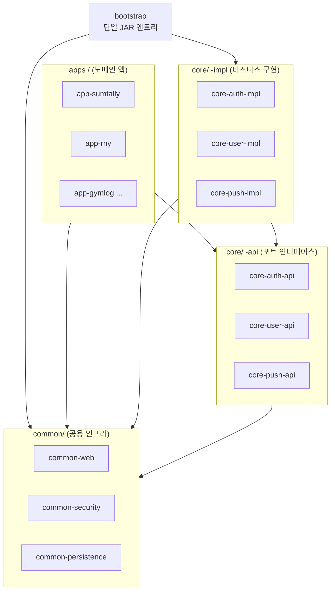
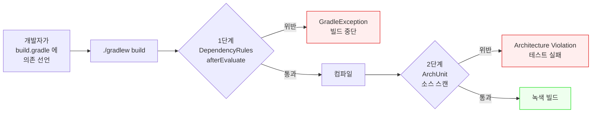

# ADR-001 · 모듈러 모놀리스 (Modular Monolith)

**Status**: Accepted. 현재 유효. 2026-04-20 기준 22개 ArchUnit 규칙 + 5개 Gradle convention plugin 으로 정교화 완료.

> **유형**: ADR · **독자**: Level 3 · **읽는 시간**: ~5분

## 결론부터

모듈러 모놀리스는 **같은 Postgres 인스턴스 안에 여러 schema 를 두는 구조** 와 같은 원리입니다. 공용 엔진(JVM / DB 프로세스) 은 한 벌로 두되, 그 안에서 각 영역(앱 모듈 / schema) 은 서로의 경계를 넘을 수 없게 만드는 거예요. Kubernetes 에서 같은 클러스터에 여러 namespace 를 두는 구조도 같은 아이디어입니다. **"한 프로세스 안의 격리 구획"** — 이것이 이 결정의 핵심입니다.

> 참고로 이 프로젝트는 실제로 ADR-005(DB 전략) 에서 같은 원리를 데이터 레이어에 한 번 더 적용합니다. 한 Postgres 에 여러 앱 schema 를 두는 것 자체가 "모듈러 모놀리스 패턴" 의 DB 버전인 셈입니다.

## 왜 이런 고민이 시작됐나?

프롤로그에서 그려 둔 `앱 공장 전략` 을 떠올리면, 이 결정이 어디서 출발했는지 보입니다. 솔로 개발자 한 명이 여러 앱을 빠르게 출시하려는 상황 — 그 위에서 **서로 다른 방향의 두 힘** 이 동시에 밀고 당깁니다.

**힘 A — 운영 부담 압축**  
앱 1개당 독립 백엔드라면 N개 프로세스, N개 배포 파이프라인, N개 모니터링 대시보드가 필요합니다. 솔로가 10개 앱을 감당하려면 **운영 단위가 1** 이어야 합니다. 프로세스도 하나, 배포도 하나, 새벽에 알림 받을 모니터링도 하나.

**힘 B — 코드 경계 유지**  
앱 간 코드가 섞이기 시작하면 나중에 **어느 하나도 떼어낼 수 없게** 됩니다. 특정 앱이 성공해서 독립 서비스로 추출해야 할 시점이 왔을 때 — 예컨대 MAU 100만을 넘겨서 자기 인프라가 필요해진 순간 — **경계가 있어야** 추출이 가능합니다. 경계 없이 섞이면 "그땐 그때 가서" 가 불가능해져요. 호출 지점이 수백 군데라서요.

두 힘은 얼핏 상충해 보입니다. "운영을 하나로" 하려면 모든 코드가 한 곳에 있어야 하고, "경계를 유지" 하려면 분리되어야 하니까요. 이 결정이 답해야 했던 물음이 바로 이것입니다.

> **운영은 한 벌이지만 구조는 N개** 로 동시에 유지할 수 있는가?

## 고민했던 대안들

아래 4가지 선택지를 검토했고, 그중 4번을 채택했습니다.

### Option 1 — 마이크로서비스 (앱당 독립 백엔드)

각 앱이 독립된 Spring Boot 서비스. 공통 코드는 라이브러리로 공유.

- **장점**: 진짜 프로세스 격리. 앱 A 의 OOM 이 앱 B 에 전혀 영향 없음. 독립 배포 / 독립 스케일링 / 독립 JDK 업그레이드 가능.
- **단점**: 10개 서비스 = 10개 배포 파이프라인 + 10개 Prometheus scrape target + 10개 Postgres connection pool + 10개 TLS 인증서 관리. **솔로 감당 불가 스케일**.
- **추가 문제**: "상태를 가진 공통 기능" (유저 테이블, 결제 테이블) 을 라이브러리로 해결하지 못합니다. 라이브러리는 로직을 공유할 뿐 DB 를 공유하지 않으므로, 각 앱이 결국 자기 `users` 테이블을 복제해야 합니다 — 드리프트 발생.
- **탈락 이유**: 힘 A 를 정면 위반.

### Option 2 — 단일 Spring Boot + 폴더만 분리 (비모듈화)

하나의 Gradle 프로젝트. `apps/app-a/`, `apps/app-b/` 폴더로 코드만 나눔.

- **장점**: 가장 단순. 초기 셋업 거의 0.
- **단점**: Java 는 **폴더 구조와 의존 관계가 무관** 합니다. `apps/app-b/` 안의 클래스에서 `import com.factory.apps.app_a.SomeUtility` 가 그냥 컴파일됩니다. 한 번이라도 실수로 얽히기 시작하면 **분리가 사실상 불가능** 해져요. 경계가 오로지 **사람 의지** 에만 기대는 구조.
- **탈락 이유**: 힘 B 를 정면 위반. 솔로 개발자에게 특히 위험합니다 — PR 리뷰어가 없으니 실수가 누적돼도 아무도 지적하지 않아요.

### Option 3 — 공통 코드를 JAR 라이브러리 + 앱당 독립 백엔드

`core-*` 를 별도 레포의 라이브러리로 발행, 각 앱이 버전 고정해서 의존.

- **장점**: 공통 코드 재사용 + 앱 격리 동시 달성.
- **단점 1**: 라이브러리 발행 오버헤드 (Maven Central 이든 사내 레포든) 가 **공통 코드 개선할 때마다** 발생. "한 줄 수정 → 발행 → 각 앱에서 버전 올림 → 테스트" 의 전체 사이클이 솔로에겐 부담.
- **단점 2**: Option 1 과 같은 "공통 상태" 문제를 해결하지 못합니다. 라이브러리는 `users` 테이블을 가질 수 없으므로 각 앱이 다시 자기 유저 테이블을 만들어야 합니다.
- **탈락 이유**: Option 1 의 운영 부담 + 라이브러리 유지 부담이 이중으로 붙음.

### Option 4 — 모듈러 모놀리스 ★ (채택)

하나의 Spring Boot JAR 안에 **Gradle 모듈 단위로 격리된** 여러 앱이 공존. 모듈 경계는 **빌드 시스템 + ArchUnit** 으로 기계에 의해 강제.

- **힘 A 만족**: 1 JAR = 1 JVM = 1 배포 = 1 모니터링.
- **힘 B 만족**: Gradle 모듈 선언이 의존을 물리적으로 차단. 사람 의지가 아닌 `GradleException` 이 얽힘을 막음.
- **공통 상태 해결**: 같은 JVM 안에서 메서드 호출로 통신 (HTTP 오버헤드 0).
- **미래 추출 경로 보장**: [`ADR-003`](./adr-003-api-impl-split.md) (`-api` / `-impl` 분리) 덕분에 특정 앱이 HTTP 서비스로 빠질 때 **인터페이스는 그대로, 구현만 HTTP 클라이언트로** 교체하면 됩니다 — 앱 코드 변경 0.

단점도 분명히 존재하지만 감당 가능한 수준입니다. 이건 아래 '이 선택이 가져온 것' 섹션에서 상세히 짚어요.

## 결정

모듈러 모놀리스를 채택하되, **경계 강제를 2단계로 중첩** 합니다. 각 단계는 서로 다른 종류의 실수를 잡아요.

### 모듈 구성 한눈에



화살표가 향하는 방향으로만 의존이 허용됩니다. 반대 방향은 모두 빌드 실패. 예를 들어 `apps` 가 `coreImpl` 로 화살표를 쏘려고 하면 즉시 차단됩니다 (아래 1단계).

### 1단계 — Gradle 모듈 경계 (빌드 시 차단)

모듈 타입마다 허용되는 의존 패턴을 미리 정의하고, 위반 시 **빌드 실패** 시키는 convention plugin 체계입니다. 총 5가지 모듈 타입이 있습니다.

| 모듈 타입 | Plugin | 허용 | 금지 |
|---|---|---|---|
| `common-*` | `factory.common-module` | 다른 `common-*` | `core-*`, `apps/*` |
| `core-*-api` | `factory.core-api-module` | `common-*`, 다른 `core-*-api` | 그 외 모든 project 의존 |
| `core-*-impl` | `factory.core-impl-module` | `common-*`, `core-*-api` | **다른 `core-*-impl`** (중요) |
| `apps/app-*` | `factory.app-module` | `common-*`, `core-*-api` | `core-*-impl`, **다른 `apps/*`** |
| `bootstrap` | `factory.bootstrap-module` | 모든 것 | — (단일 엔트리) |

각 모듈의 `build.gradle` 최상단에서 해당 plugin 을 한 줄로 선언합니다.

```gradle
// core/core-auth-api/build.gradle
plugins {
    id 'factory.core-api-module'
}

dependencies {
    api project(':common:common-web')
    api project(':core:core-user-api')  // 다른 core-api 는 허용
    // api project(':core:core-user-impl')  // ← 이 줄이 있으면 빌드 fail
}
```

위반 감지는 [`DependencyRules.groovy`](https://github.com/storkspear/template-spring/blob/main/build-logic/src/main/groovy/com/factory/DependencyRules.groovy) 가 `afterEvaluate` 단계에서 수행합니다. `ProjectDependency` 인스턴스들의 `path` 를 검사해서 `forbiddenPattern` 에 매치되거나 `allowedPrefixes/Exact/Pattern` 어디에도 해당하지 않으면 `GradleException` 을 throw 합니다. 이 검증은 `main` configuration 에만 적용돼요 — `testImplementation` / `testFixtures` 는 교차 의존이 필요한 경우가 있어 스펙상 예외입니다.

### 2단계 — ArchUnit 런타임 검증 (소스 스캔)

1단계가 "의존성 선언" 을 잡는다면, 2단계는 **실제 바이트코드의 타입 참조** 를 잡습니다. 예컨대 "선언은 안 했지만 reflection 으로 클래스를 가져오는" 종류의 얽힘을 검증합니다.

canonical 규칙은 [`ArchitectureRules.java`](https://github.com/storkspear/template-spring/blob/main/common/common-testing/src/main/java/com/factory/common/testing/architecture/ArchitectureRules.java) 에 22개 public static final ArchRule 상수로 정의돼 있습니다. 규칙 1~5 가 이 결정과 직접 연관돼요.

```java
public static final ArchRule APPS_MUST_NOT_DEPEND_ON_CORE_IMPL =
    noClasses()
        .that().resideInAPackage("..apps..")
        .should().dependOnClassesThat().resideInAPackage("..core..impl..")
        .allowEmptyShould(true)
        .as("r1: apps/* must not depend on core-*-impl (ports only)");

public static final ArchRule APPS_MUST_NOT_DEPEND_ON_EACH_OTHER =
    slices()
        .matching("com.factory.apps.(*)..")
        .should().notDependOnEachOther()
        .allowEmptyShould(true)
        .as("r2: apps/* must not depend on each other");
// ... r3~r22
```

`allowEmptyShould(true)` 는 **template 상태** (apps 모듈이 0개) 를 지원하기 위한 flag 입니다. "검사할 클래스가 0개" 라고 해서 테스트 실패시키지 않고 vacuously true 로 통과시켜요. 파생 레포에서 apps 가 추가되면 자동으로 규칙이 활성화됩니다.

실제 스캔은 `bootstrap` 모듈의 test classpath 에서 이루어집니다 ([`BootstrapArchitectureTest.java`](https://github.com/storkspear/template-spring/blob/main/bootstrap/src/test/java/com/factory/bootstrap/BootstrapArchitectureTest.java)). `@AnalyzeClasses(packages = "com.factory")` 로 common-*, core-*, bootstrap 을 전부 스캔해요. bootstrap 이 모든 모듈을 `implementation` 으로 의존하므로 단일 classpath 에 모든 클래스가 모여있어 이 스캔이 가능합니다.

### 2단계 방어의 흐름



두 단계는 서로 다른 실수를 잡습니다.

- **1단계만 있으면**: `build.gradle` 선언은 깨끗한데 소스에서 `Class.forName()` 같은 reflection 으로 타인 모듈 클래스를 끌어오는 경우를 못 잡음.
- **2단계만 있으면**: 소스 참조는 없지만 `runtime` / `compileOnly` 로 잘못 선언한 의존이 배포 아티팩트에 들어가는 경우를 빌드 시간에 못 잡음.

두 단계가 중첩되어 **선언 실수** 와 **사용 실수** 를 각각 차단합니다.

### Counter-example — 실제로 위반하면 어떻게 막히나

이론만 들으면 감이 잘 안 올 수 있어서, 실제 차단 메시지를 같이 보는 게 좋아요.

**Case 1 — `apps/app-sumtally/build.gradle` 에 실수로 `core-auth-impl` 의존 선언**

```gradle
// apps/app-sumtally/build.gradle (잘못된 선언)
dependencies {
    implementation project(':core:core-auth-impl')  // 금지된 의존
}
```

`./gradlew :apps:app-sumtally:compileJava` 실행 시:

```
[factory] Dependency rule violation
  module : :apps:app-sumtally
  config : implementation
  depends: :core:core-auth-impl
  reason : forbidden pattern
See docs/conventions/module-dependencies.md

> FAILURE: Build failed with an exception.
```

컴파일 단계 이전 `afterEvaluate` 에서 차단되어 **클래스 파일 자체가 만들어지지 않습니다**. 개발자는 즉시 `core-auth-api` 만 의존하도록 수정해야 해요.

**Case 2 — reflection 으로 우회 시도 (1단계 통과 후 2단계에서 차단)**

```java
// apps/app-sumtally/src/main/java/.../SomeController.java
Class<?> impl = Class.forName("com.factory.core.auth.impl.EmailAuthServiceImpl");
```

이건 `build.gradle` 의존 선언에 없어도 컴파일됩니다 (reflection 은 문자열). 하지만 ArchUnit 이 컴파일된 바이트코드를 스캔해서 타입 참조를 찾아냅니다.

```
Architecture Violation [Priority: MEDIUM] - Rule 'r1: apps/* must not depend on
core-*-impl (ports only)' was violated (1 times):
Method <com.factory.apps.sumtally.SomeController.doSomething()> references
class <com.factory.core.auth.impl.EmailAuthServiceImpl> via
Class.forName in (SomeController.java:42)

> Task :bootstrap:test FAILED
```

CI 에서 빨간불이 뜨고 merge 가 차단됩니다. 1단계 우회를 2단계가 잡아내는 것이 보이는 구조예요.

## 이 선택이 가져온 것

### 긍정적 결과

**운영 단위 1** — `./gradlew :bootstrap:bootRun` 한 줄이 모든 앱을 기동합니다. 배포도 1 JAR, 롤백도 1 JAR. 모니터링 대시보드도 Spring Boot Actuator 하나. 솔로가 감당 가능한 수준이 유지됩니다.

**공유 인프라의 상태 유지** — 같은 JVM 이므로 HikariCP 커넥션 풀, JPA 엔티티 매니저, Spring Security 필터 체인을 앱 간에 공유(또는 분리)하는 선택을 제로 오버헤드로 할 수 있습니다.

**모듈 경계가 기계에 의해 강제** — 5개 convention plugin + 22개 ArchUnit 규칙이 경계를 **사람 의지** 로부터 분리합니다. 솔로 개발자가 피곤한 날에도 실수로 얽힘이 들어가지 않아요.

**추출 경로 보장** — 특정 앱이 성공해서 독립 서비스로 가야 할 때 필요한 것은 "AuthServiceImpl (같은 JVM)" 을 "AuthHttpClient (HTTP 클라이언트)" 로 교체하는 것뿐입니다 — [`ADR-003`](./adr-003-api-impl-split.md) 의 포트/어댑터 패턴 덕분.

### 부정적 결과

**단일 JVM 장애 = 전체 장애** — 앱 하나의 OOM 이나 infinite loop 가 전체 JVM 을 죽입니다. 완화책은:
- Spring Boot Actuator 의 health endpoint 로 빠른 감지
- Resilience4j 서킷 브레이커로 앱 간 cascading 차단
- Kamal 의 blue/green 배포로 다운타임 30초 내로 격리
- 특정 앱이 실제로 빈번하게 장애 일으키면 그 시점에 해당 모듈만 추출 ([`ADR-003`](./adr-003-api-impl-split.md) 경로 활용)

**Memory footprint 선형 증가** — 앱 10개면 엔티티 매니저 10 세트, HikariCP 풀 10개, Spring Security 필터 체인 10벌이 한 JVM 안에 공존. 맥미니급 호스트(16GB~32GB) 에서 안전한 앱 수는 대략 **10~15개** 로 추정.

**JDK / Spring Boot 업그레이드의 전체 동반** — 한 앱만 JDK 25 로 먼저 올리거나 Spring Boot 4.0 으로 먼저 가는 것이 불가능합니다. 우리 스케일에서는 오히려 장점(버전 드리프트가 없음)이지만, 여러 팀이 개입하는 조직에서는 문제가 될 수 있습니다.

### 감당 가능성 판단

이 부정 결과들은 **감당 가능한 범위** 입니다. 단일 JVM 장애는 서킷 브레이커로 90% 완화되고, 메모리 선형 증가는 인디 스케일(앱당 MAU 1만~10만) 에서는 문제 되지 않으며, 버전 동반 업그레이드는 오히려 드리프트 방지 효과. **특정 앱이 인디 스케일을 넘어가는 순간** (예: MAU 100만) 이 오면 그때 그 앱을 [`ADR-003`](./adr-003-api-impl-split.md) 경로로 추출하면 됩니다.

## 교훈

**2026-04-20 — `core-auth-impl` 의 `AuthController` 를 런타임에서 제거한 사건.**

초기 설계에서는 `core-auth-impl` 안의 `AuthController` 가 `AuthAutoConfiguration` 에 의해 `@Import` 되어 **런타임 bean 으로 등록**되었습니다. 이때 경로는 `/api/core/auth/*` 였고 모든 앱이 이 하나의 Controller 를 공유했어요.

이 구조는 "어느 앱의 인증 요청인지" 를 런타임에 구분해야 해서 `AbstractRoutingDataSource` + `ThreadLocal` 멀티테넌트 라우팅이 필요했습니다. `ThreadLocal` 은 `@Async` / Virtual Thread 환경에서 컨텍스트 소실 문제가 있었고, Spring Security 필터 체인과의 상호작용이 복잡했어요.

이 복잡도가 "모듈러 모놀리스" 의 본래 목표 — **각 앱이 자기 경계 안에서 단순하게 동작** — 와 어긋난다는 것이 드러났고, 2026-04-20 에 `AuthAutoConfiguration` 의 `@Import(AuthController.class)` 가 제거되었습니다. 이제 `core-auth-impl/controller/AuthController.java` 는 런타임 bean 이 아니라 **`new-app.sh` 가 참조하는 스캐폴딩 소스** 로만 존재합니다.

**교훈**: 모듈러 모놀리스의 "모듈" 경계는 **앱 간 상호작용이 실제로 어떻게 일어나는가** 까지 반영해야 합니다. 엔드포인트가 공유되면 상태(ThreadLocal) 공유가 따라오고, 결국 "모듈" 이 겉보기만 분리된 상태가 됩니다. 경계는 **코드 분리 + 라우팅 분리** 가 모두 만족되어야 진짜 경계예요.

## 관련 사례 (Prior Art)

- **[Spring Modulith](https://github.com/spring-projects/spring-modulith)** (Spring 공식, Oliver Drotbohm 주도) — Java 패키지 경계를 모듈로 취급하고 ArchUnit 을 내장해 위반을 빌드 시간에 잡습니다. 이 레포의 접근과 매우 유사하지만 Gradle 모듈 분리까지는 가지 않습니다.
- **Shopify "Component-based Modular Monolith"** — 하나의 Rails 모놀리스를 domain component 단위로 쪼개고 component 간 의존을 명시적으로 관리하는 접근.
- **Martin Fowler "MonolithFirst"** — 새로운 시스템은 모놀리스로 시작하고 필요해질 때 쪼개라는 고전적 조언.

## Code References

**모듈 레이아웃**:
- [`settings.gradle`](https://github.com/storkspear/template-spring/blob/main/settings.gradle) — 전체 모듈 include (common × 5, core × 12 = api/impl × 6 pair, bootstrap × 1, apps × 0)
- [`apps/README.md`](https://github.com/storkspear/template-spring/blob/main/apps/README.md) — 현재 앱이 0개임을 명시하는 placeholder

**Convention plugin 5종** (경로: `build-logic/src/main/groovy/`):
- [`factory.common-module.gradle`](https://github.com/storkspear/template-spring/blob/main/build-logic/src/main/groovy/factory.common-module.gradle)
- [`factory.core-api-module.gradle`](https://github.com/storkspear/template-spring/blob/main/build-logic/src/main/groovy/factory.core-api-module.gradle)
- [`factory.core-impl-module.gradle`](https://github.com/storkspear/template-spring/blob/main/build-logic/src/main/groovy/factory.core-impl-module.gradle)
- [`factory.app-module.gradle`](https://github.com/storkspear/template-spring/blob/main/build-logic/src/main/groovy/factory.app-module.gradle)
- [`factory.bootstrap-module.gradle`](https://github.com/storkspear/template-spring/blob/main/build-logic/src/main/groovy/factory.bootstrap-module.gradle)

**DSL 구현**:
- [`DependencyRules.groovy`](https://github.com/storkspear/template-spring/blob/main/build-logic/src/main/groovy/com/factory/DependencyRules.groovy)

**ArchUnit**:
- [`ArchitectureRules.java`](https://github.com/storkspear/template-spring/blob/main/common/common-testing/src/main/java/com/factory/common/testing/architecture/ArchitectureRules.java)
- [`BootstrapArchitectureTest.java`](https://github.com/storkspear/template-spring/blob/main/bootstrap/src/test/java/com/factory/bootstrap/BootstrapArchitectureTest.java)
- [`ArchitectureTest.java`](https://github.com/storkspear/template-spring/blob/main/common/common-testing/src/test/java/com/factory/common/testing/architecture/ArchitectureTest.java)

**Bootstrap 묶음**:
- [`bootstrap/build.gradle`](https://github.com/storkspear/template-spring/blob/main/bootstrap/build.gradle)

